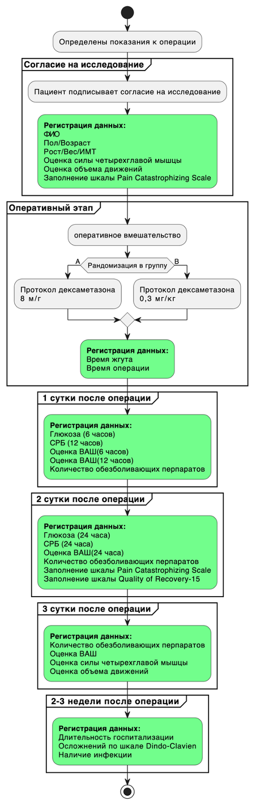
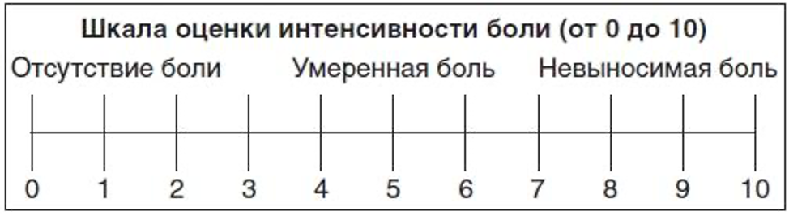

```{r setup, include=FALSE}
knitr::opts_chunk$set(echo = TRUE)
```

Федеральное государственное бюджетное образовательное учреждение высшего образования «Санкт-Петербургский государственный университет» Клиника высоких медицинских технологий им. Н. И. Пирогова

Травматологическое отделение №2

# Протокол клиического исследования

## Тема "Влияние периоперационной дозы дексаметазона на послеоперационный болевой синдром"

Специальность: 3.1.8 -- травматология и ортопедия

Срок выполнения: 2024 гг.

Исполнитель: врач травматолог-ортопед отделения травматологии №2, Клименко В.С.

Санкт-Петербург, 2023 г.

## 1. Актуальность

Операция тотального эндопротезирование коленного сустава (ТЭПКС) является одной из наиболее часто выполняемых и экономически эффективных операций на опорно-двигательном аппарате. На протяжении последних нескольких десятилетий потребность в этой процедуре продолжает возрастать во всем мире [@price2018]. ТЭПКС стало золотым стандартом лечения пациентов с терминальными стадиями артроза коленного сустава [@sharma2021osteoarthritis]. В тоже время нельзя не отметить, что боль остается серьезной проблемой в раннем послеоперационном периоде [@aasvang2015]. Это, наряду с послеоперационным отеком и мышечной слабостью, препятствует ранней мобилизации и реабилитации пациентов [@petersen2020]. Несмотря на применение мультимодальной аналгезии, включающей НПВП, парацетамол, местную инфильтрационную анестезию, выраженность болевых ощущений зачастую сохраняется на среднем или высоком уровне после операции [@webb2018].

Кортикостероиды являются мощными противовоспалительными препаратами и играют физиологическую роль в подавлении медиаторов воспаления. Они доказали свою эффективность в послеоперационном обезболивании после различных видов операций [@salerno2006; @kjetil2007; @romundstad2004; @bisgaard2003].

В последние годы были проведены метаанализы, оценивающие эффективность дексаметазона для контроля боли при тотальном эндопротезировании коленного или тазобедренного сустава [@fan2018; @liu2017; @meng2017; @mohammad2018perioperative; @hannon2022]. Несмотря на то, что исследования явно показывают преимущество периоперационного использования дексаметазона при выявленной безопасности, авторы указывают, что по-прежнему необходимы исследования изучения взаимосвязи между осложнениями и реакцией на дозу, чтобы сделать окончательный вывод.

Существуют исследования, которые указывают на оптимальную дозу, которая принята на сегодняшний день 4-8 мг [@lunn2011], однако проблему применения наркотических средств в раннем послеоперационном периоде эта доза не решает и эффект более высоких доз глюкокортикоидов является перспективным направлением модуляции послеоперационного ведения боли [@nielsen2022; @toner2017; @hah2017] .

## 2. Степень разработанности проблемы

Вопрос увеличения дозы является дискутабельным и нами был проведен анализ литературы посвященной повешенных доз.

Nielsen, Niklas I et al. в 2022 году [@nielsen2022] провели исследование в котором сравнивались различные высокие дозы (1,0 и 0,3 мг/кг). По сравнению с предоперационным введением дексаметазона в дозе 0,3 мг/кг внутривенно, дексаметазон в дозе 1 мг/кг уменьшал боль через 24 часа после ТЭПКС и улучшал восстановление у пациентов с высокой реакцией на боль без видимых побочных эффектов.

Chan, Timmy Chi Wing et al. в 2020 году [@chan2020] сравнивали группы пациентов с увеличенной дозой 16мг, нормальной дозой 8 мг и плацебо. Прием дексаметазона в дозе 16 мг перед ТЭПКС привел к уменьшению послеоперационной боли, меньшему потреблению наркотических анальгетиков, увеличению силы четырехглавой мышцы и улучшению общего качества восстановления после операции.

В нашем лечебном учреждении принят анестезиологический протокол, предполагающий введение 8 мг дексаметазона, при выполнении эндопротезирования коленного сустава, это соответствует общепринято практике [@lunn2011].

Опираясь на представленные выше метаанализы, а также информации из более поздних клинических исследований [@nielsen2022; @chan2020], в этой работе предполагается оценить эффективность повышенных дозировок дексаметазона: 0,3 мг/кг на уровень послеоперационного болевого синдрома, без увеличения побочных эффектов, по сравнению с стандартной дозой 8 мг [@lunn2011] .

## 3. Цель исследования

Провести клиническую оценку эффективности интраоперационных повышенных дозировок дексаметазона: 0,3 мг/кг на уровень послеоперационного болевого синдрома, по сравнению с стандартной дозой 8 мг.

## 4. Предмет исследования

1.  Болевой синдром в первые сутки после ТЭПКС, определяемое визуальными шкалами
2.  Ранее восстановление пациента после ТЭПКС, определяемое в ОД и силу мышцы.

## 5. Объект исследования

Пациенты, перенесшие первичное тотальное эндопротезирование коленного сустава

## 6. Методы исследования

Моноцентровое проспективное 2 слепое рандомизированное клиническое исследование планируется провести в период с января 2024 года по декабрь 2024 года. Планируется участие пациентов с диагнозом: «Идиопатический гонартроз III стадии»

Планируемое количество пациентов 92 человека. Расчет количества пациентов проводился методом определения мощности пропорций по относительному показателю боли, выраженному в процентах (%) в уже проведенном в 2021 исследовании Nielsen N.I. и коллег [@nielsen2022], а именно был взят показатель боль при ходьбе через 24 часа после операции уменьшилась (высокая доза по сравнению со средней дозой, 49% против 79%; P\<0,01) [@nielsen2022].

Разделение на группы будет выполнено по методу рандомизации. Метод рандомизации и метод двойного ослепления будет производиться следующим образом: при поступлении на отделение лечащий врач из заранее заготовленных закрытых конвертов, вытягивает конверт с указанием кода, который вклаыдывает в историю болезни вместе с подписанным согласием на исследование. Расшифровка кода в процессе госпитализации будет доступна только операционной медсестре, которая выполняет набор препарата. Набор препарата должен быть выполнен в одинаковом объеме и шприц с препаратом должен будет выгядеть одинаково. Недостающий объем будет дополняться физиологическим раствором.

В группу А (предположительно 48 человек) буду включены пациенты, которым будет проводится протокол интраоперационного введения дексаметазона 0,3 мг/кг (исследуемая группа). В группе Б (предположительно 48 человек) будут включены пациенты, которым будет проводится интраоперационного введения дексаметазона 8 мг. (контрольная группа).

**Критерии включения пациентов:**

• пациенты, поступившие в отделение для не осложненного тотального эндопротезирования коленного сустава.

**Критерии не включения пациентов:**

• сахарный диабет

• носительство вируса гепатита В или С

• специфический артрит

• хроническая почечная недостаточность (креатинин \>200 мкмоль/л)

• язвенная болезнь

• хроническое применение глюкокортикойдов

• иммунодепрессантов, иммуномодулирующих препаратов, опиойдов.

**Регистрируемые данные:**

• Фамилия Имя Отчество

• Возраст

• Рост

• Вес

• Пол

• ИМТ

• Сопутсвующие заболевани (в частности нарушения толерантности к глюкозе) • Длительность госпитализации

• Время жгута

• Время операции

*Клинические методы исследования:*

• Оценка ВАШ до операции / 6 часов / 24, 48, 72 часа после операции Пример шкалы ВАШ представлен в приложении (16.1). Пациенту будет предлагаться самостоятельно заполнить шкалу.

• Оценка силы 4-х главой мышцы до операции и на 3 сутки после. Straight leg raise (SLR) – тест. Для оценки SLR пациентов просили поднять прооперированную ногу с кровати, не сгибая колено, и удерживать это положение в течение 10 секунд. В нашем исследовании планируется исследовать количество дней от операции до первого положительного SLR теста и показатель будет записываться как время в часах [@suh2021].

• Оценка объема движений до операции и на 3 сутки после. Методика измерения: Активное сгибание: положение пациента на спине на кушетке. Нижняя конечность расслаблена. Пациент, не отрывая пятку от кушетки производит сгибание в коленном суставе, затем разгибание. Угол сгибания в коленном суставе измеряется угломером. Результат регистрировался в градусах с точностью 1 градус. Пассивное сгибание: положение пациента на спине на кушетке. Нижняя конечность расслаблена. Врач своими руками производит сгибание в коленном суставе, затем разгибание. Измеряется угол в коленном суставе угломером. Результат регистрировался в градусах с точностью 1 градус.

• Регистрация осложнений по шкале Dindo-Clavien Классификации представлена в приложении (16.3)

• Количество обезболивающих препаратов, наркотического ряда за время стационарного лечения Регистрируется название препарата, его дозировка, количество применения в сутки. • Регистрация наличия инфекция в течении 2-3недель, т.е. на момент снятия швов. Регистрируется осложнение на момент завершения наблюдения 2-3 недели после операции.

-   Quality of Recovery-15 на 24 часа после операции

Пример шкалы анкеты представлен в приложении (16.4). Пациенту будет предлагаться самостоятельно заполнить шкалу [@никитина2022разработка].

-   Pain Catastrophizing Scale до операции и на 24 часа после операции

Пример шкалы анкеты представлен в приложении (16.5). Пациенту будет предлагаться самостоятельно заполнить шкалу [@radchikova2020russian] .

Лабораторные:

-   Биохимический панализ крови с учетом СРБ до операции 1,2 день после [@shadyab2018prospective].

-   Биохимический панализ крови с учетом глюкозы в крови на 6 часов и 24 часа

Статистические методы: сбор данных будет осуществляться при помощи программ Exel [@walkenbach2010excel]. Статистическая оценка будет проводиться с помощью встроенных пакетов программы Statistica 12 [@de2007applied]. Для параметрических данных будет определяться нормальность распределения с помощью построения QQ-plot графика[@bensken2021basicP1]. При нормально распределении для независимых выборок будет применяться t-тест Стьюдента, при ненормальном распределении U-тест Манна-Уитни. Для определения категориальных данным будет применяться либо Хи-кадрат Пиросона или точный критерий Фишера в зависимости требований, предъявляемых к данным[@bensken2021basicP2].

## 7. Средства исследования:

• Форма оценки болевого синдрома ВАШ • Форма оценки осложнений шкала Dindo-Clavien • Набор хирургического инструментария, расходного материала и силового и специализированного оборудования

## 8. Объем планируемых исследований

Основные этапы проведения исследования представлены на рисунке №1.



Рисунок №1. Объем планируемых исследований

## 9. Определение ролей исследователей по системе CRediT

В настоящем исследовании применена система CRediT, которая предоставляет авторам настоящего исследования описать точное и подробное описанием своего разнообразного вклада в опубликованную работу. Подробное описание представлено в приложении (16.2) 1. Клименко Вадим Сергеевич – концептуализация, методология, написание, рецензирование и редактирование научной публикации, контроль и управление проектом 2. Дорогинский Святослав Станиславович – сбор и валидация, данных, формальный анализ, проведение исследования 3. Бобиков Данил Георгиевич - сбор и валидация, данных, формальный анализ, проведение исследования 4. Повалий Андрей Александрович – методология, обработка данных, визуализация, первичный текст научной публикации

## 10. Научная новизна

На основании исследования будет определена эффективность применения протокола интраоперационного использования повышенной дозы дексаметазона 0,3 мг/кг.

## 11. Ожидаемые результаты

Согласно данным изученной литературы, ожидается более значимый результат в пользу группы B по показателям боли, потреблению наркотических обезболивающих и более низкий уровень СРБ, больший объем движений, большая сила 4-х главой мышцы. Отсутствие разницы между группами по показателям глюкоза в крови, осложнения и наличие послеоперационной инфекции.

## 12. Возможная область применения результатов исследования

Результаты могут быть использованы в практической деятельности врачей травматологов-ортопедов в условиях стационара и учебно-педагогическом процессе студентов и врачей.

## 13. Формы внедрения:

Публикация статьи в научном журнале, издании методических пособий для практикующих врачей, выступление на российских конгрессах, в том числе с международным участием. Также результаты настоящего исследования являются частью диссертационного исследования Клименко В.С. по специальности “3.1.8 – травматология и ортопедия”.

## 14. Практическая значимость

Формулирование рекомендации - повешенная доза интраоперационного введения дексаметазона 0,3 мг/кг эффективно влияет на уровень послеоперационного болевого синдрома при сопоставимой безопасности по сравнения с принятыми дозами.

## 15. Охраноспособность

Планируемая тема является охраноспособной.

## 16. Приложение

1.  Шкала ВАШ



2, Система CRediT (Contributor Roles Taxonomy) 

3.  шкала Dindo-Clavien

    I степень

    • Неэффективность стандартной нестероидной противовоспалительной терапии, требующая назначения опиоидов и применения других способов обезболивания (в т.ч. с последующим увеличением срока наблюдения за пациентом)

    • Пролонгированная антибиотикопрофилактика и антибактериальная терапия

    • Незначительные или умеренные осложнения или особенности оперативного лечения, приводящие к ограничению или отсутствию опорной нагрузки на прооперированную конечность

    • Кровотечение из раны, не требующее применения лекарственных или хирургических гемостатических мероприятий (давящая повязка, возвышенное положение конечности, местная гипотермия)

    • Местные изменения кожных покровов, в т.ч. пролежни 1-2 степени, кожные пузыри на фоне отека (волдыри, везикулы).

    II степень

    • Продолжающееся кровотечение, требующее применение дополнительных методов гемостаза (плазмотрансфузии, системные гемостатики и тд.)

    • Анемия средней и тяжелой степени, требующая проведения гемотрансфузии

    • Периферические неврологические нарушения, связанные с оперативным вмешательством и/или анестезией, не требующие дополнительных вмешательств

    • Послеоперационные неосложненные травмы

    • Умеренная контрактура, не требующая дополнительных оперативных вмешательств

    • Интраоперационная фрагментация костных отломков, требующая дополнительных средств фиксации и изменения послеоперационного режима

    • Тромбоз глубоких вен нижних конечностей

    III степень\*

    • Активное продолжающееся кровотечение, требующее хирургических методов гемостаза

    • Расхождение краев раны, требующее наложение швов

    • Некроз краев раны, требующее некрэктомии

    • Остеолиз, в том числе с формированием секвестра

    • Выраженная контрактура, в том числе с гетеротопической оссификацией капсулы сустава, приводящая к стойкому нарушению функции сегмента

    • Ранняя и поздняя раневая инфекция, требующая санации

    • Стойкие периферические неврологические нарушения, требующие дополнительных оперативных вмешательств (невролиз, декомпрессия и тд.)

    • Несрастание зон остеотомии, приводящие к формированию ложных суставов и выраженному нарушению функции сегмента

    • Посеоперационные травмы, осложненные вторичным смещением костных отломков и/или металлоконструкций, переломами костей, повреждением капсульно-связочных аппаратов, требующие повторных вмешательств

    • Рецидив или возникновение вторичных деформаций

    IIIa - дополнительные вмешательства без общей анестезии

    IIIb - дополнительные вмешательства под общей анестезией IV степень

    IV A Недостаточность одного органа/системы органов: печеночная недостаточность, почечная недостаточность, нарушения ритма СС, сердечная недостаточность, дыхательная недостаточность (декомпенсация ХОБЛ или БА) центральные неврологические нарушения и тд.

    IV B Полиорганная недостаточность: ТЭЛА, сепсис и тд.

    \
    V степень Смерть пациента

4.  анкета Quality of Recovery-15


5.  анкета Pain Catastrophizing Scale


## 17. Список сокращений

ТЭПКС -- тотальное эндопротезирование коленного сустава

Hb -- гемоглобин

ОД - объема движений

ВАШ- визуальная аналоговая шкала

СРБ - С-реактивный белок

SLR - Straight leg raise (Подъём прямой ноги)

CRediT - Contributor Roles Taxonomy

## 18. Список используемой литературы
