```{r setup, include=FALSE}
knitr::opts_chunk$set(echo = TRUE)
```

# ГЛАВА 2. МАТЕРИАЛЫ И МЕТОДЫ

## 2.1 Общая структура настоящего исследования

Настоящее диссертационное исследование состояло из двух последовательных частей в каждой из которых были 2 этапа: клиническая часть первый этап, экспериментальная первый и второй этапы и клиническая часть второй этап.
Все части части исследования находились в логическое связи, были последовательны и взаимно дополняли друг друга.

Клиническая часть состояла из четырех этапов: Первый этпап был ретроспективным клиническим, второй этап был экспериментальным третий этпап был клинико-экспериментальным клиническим и четвертый этап был проспективным клиническим.
Все исследование было выполнено на основании изучения клинических и рентгенологических данных пациентов с НСП ДМЭ ЛК ДМЭ ЛК , проходивших лечение в травматологическом отделении №2 Клиники высоких медицинских технологий СПбГУ с апреля 2018 года по сентябрь 2022 Всего было исследовано 109 пациентов и 34 человека с не поврежденной конечностью.
Всего в исследовании было 5 групп.
Схема исследования представлена на рисунке №2.1.

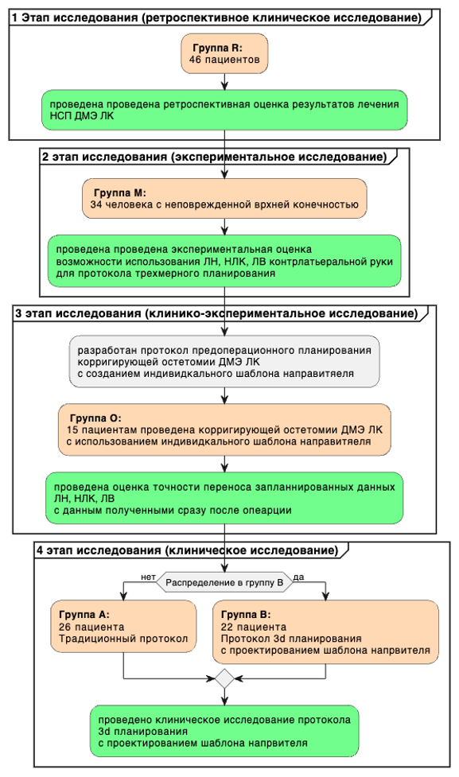

Рисунок №2.1.
Общая схема настоящего диссертационного исследования На первом этапе было исследовано 46 пациентов.
Эту часть исследования можно охарактеризовать как ретроспективное кагортное исследование Была сформирована группа R (R- от английского 'retrospective' - ретроспективный).
Регистрировались и оценивались такие показатели анамнеза, инструментальные данные и данные анкетирования (более подробно в разделе ' 2.1.5 Регистрируемые данные и класификаторы ') По выявленным показателям проводилась оценка качества коррегирующей остеотомии ДМЭ ЛК при неправильом сращениии ДМЭ ЛК

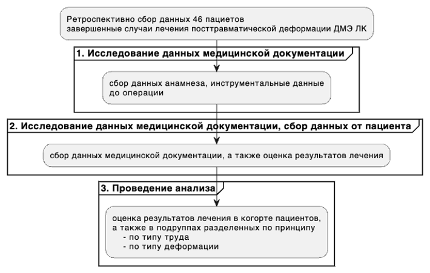

Рисунок №2.2.
Схема первого этапа исследования На втором этапе было исследовано 34 человека с неповрежденной врхней конечностью.
Была сформирована группа M (M- от английского 'measurement' - измерение).
Участникам исследования проводиласть мультиспиральная компьютерная томография обеих лучезапястных суставов (МСКТ, подробное описание исследование указано в разделе « 2.2.1 Методы лучевой диагности и оценка референтных значений » текущей главы) Регистрировались и оценивались такие инструментальные данные (более подробно в разделе ' 2.2.4 Регистрируемые данные и класификаторы ') Далее проводилось сравнение противоположных конечностей с целью решения вопросв 'Можно ли использовать показатели противоположной руки для моделирования коррегирующей остеотомии?'

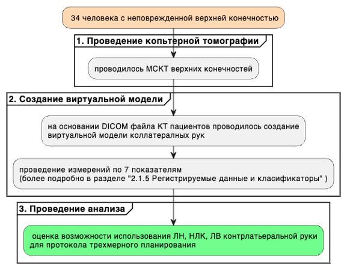

Рисунок №2.3.
Схема второго этапа исследования Затем проводился третий этап и было исследовано 44 пациентов.
Была сформирована группа O (O- от английского 'opening' - открытие, дебют).
Была проведена разработка протоола пердоперационного планирования с созданием шаблона направителя Пациентам на этом этапе предлагалось пройти по протоколу лечения с использованием шаблона направителя.
При получении согласия пациенты проводиласть МСКТ обеих верхних конечностей и перед госпитализацией проводилось трехмерное планирование коррегирующей остеомии лучевой кости с созданием индивидуального шаблона-направителя подробное описание протокола планирования указано в разделе ' 2.2.7 Протокол трехмерного планирования коррегирующей остеомии лучевой кости с созданием индивидуального шаблона-направителя текущей главы Регистрировались и оценивались такие инструментальные данные (более подробно в разделе ' 2.2.4 Регистрируемые данные и класификаторы ') Далее проводилось сравнение противоположных конечностей с целью решения вопросв 'Можно ли использовать показатели противоположной руки для моделирования коррегирующей остеотомии?'

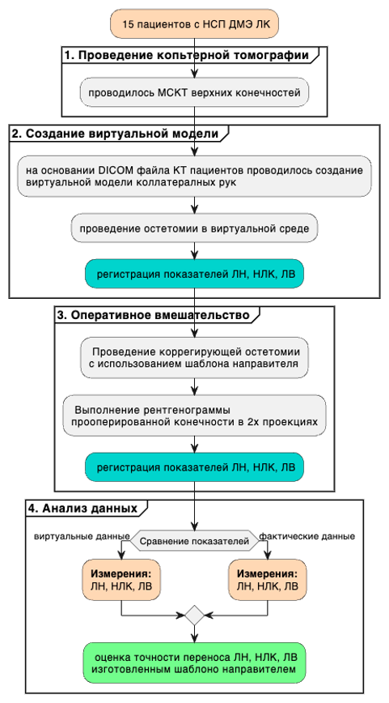

Рисунок №2.4.
Схема третьего этапа исследования На четвертом этапе было исследовано 48 пациентов.
Была проведена разработка протоола пердоперационного планирования с созданием шаблона направителя Пациенты были разделены на 2 группы: A и B - принцип названия взят как порядковые буквы латинского алфавита.
Группа A была контрольной и в нее вошли 26 пациенов.
В этой группе протокол лечения был по традиционной методике.
Во вторую группу вошли 22 пациенов.
Это группа была исследуемой.
Пациенты проходили лечение с применением разработанного протокола трехмерного планирования с применением шаблона направителя.
Данные, регистрируемые на этом этапе подробно в описаны в разделе разделе ' 2.2.4 Регистрируемые данные и класификаторы ') Это этап стал завершающим настоящее диссертационное исслеование

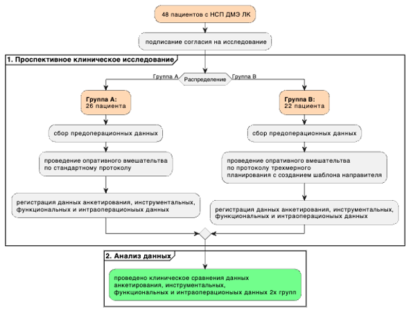

Рисунок №2.5.
Схема четвертого этапа исследования \### 2.1.1 Критерии включения и исключения

Критериями включения для этапов исследования, где исследемыми были пациенты с НСП ДМЭ ЛК заболевание должно было проявляться болью в запястье, деформацией и ограничением объема движений.
Диагноз посттравматической деформации НСП ДМЭ ЛК устанавливался на основании полного сбора анамнеза и данных рентгенологического исследования лучезапястного сустава в прямой и боковой проекциях.
Все пациенты перенесли внесуставной перелом, первоначально была выполнена закрытая ручная репозиция отломков с последующей гипсовой иммобилизацией в среднем на 6-8 недель.
Хирургическое лечение этим пациентам ранее не проводилось.

Критериями включения для этапа исследования, где исследемыми были участники без патологии было отсутвие повреждения ДМЭ, предплечья и кисти в анамнезе

Критериями исключения были:

• сахарный диабет

• носительство вируса гепатита В или С

• специфический артрит

• хроническая почечная недостаточность (креатинин \>200 мкмоль/л)

• язвенная болезнь

• хроническое применение глюкокортикойдов

• иммунодепрессантов, иммуномодулирующих препаратов, опиойдов.

## 2.2 Описание методов диссертационного исследования

В настоящем диссертационном исследовании использовались функциональные методы оценки функции лучезапястного сустава и предплечья.
В качестве инструментальных методов оценки использовался рентген ДМЭ ЛК в двух проекция (прямая и бокова), а так же МСКТ лкчезапястного сустава.
Так же применялись шкалы оценки состояния верхней конечности (DASH) и общего сотсояния здоровья (SF-16).
В исследовании проводилось оперативное вмешательство: коррегирующая остетомия ДМЭ ЛК Прооперированным пациентам назначался протокол послеоперационного ведения Изучаеммым методом был 'Протокол трехмерного планирования коррегирующей остеомии лучевой кости с созданием индивидуального шаблона-направителя'.
### 2.2.1 Методы лучевой диагности и оценка референтных значений *Рентгенологическая оценка*

В исследовании использовались три основных рентгенологических измерения для оценки ДМЭ ЛК: ЛВ, НЛК и ЛН [@graham1997].

Измерение проводилось на рентгенограмме в прямой проекции ЛВ измерялось как расстояние между двумя линиями, проведенными перпендикулярно длинной оси лучевой кости в прямой проекции от вершины шиловидного отростка лучевой кости и уровня суставной поверхности локтевой кости.
Нормальная ЛВ находится в диапазоне 8-14 мм [@lalone2015; @perugia2014].

Измерение проводилось на рентгенограмме в прямой проекции НЛК — это наклон дистальной поверхности лучевой кости по отношению к ее оси.
Угол радиального наклона определялся в прямой проекции как угол между линией, проведенной между точкой шиловидного отростка лучевой кости и самой медиальной точки суставной поверхности локтевой кости [@pope2014musculoskeletal].
Показатель 21-25° считался нормальным [@harisinghani2018primer; @guglielmi2001fundamentals].

ЛН оценивался на рентгенограмме лучезапястного сустава в боковой провкции, соответствовал углу, образованному линией, проведенной перпендикулярно оси лучевой кости, и линией, которая проходит через крайние точки тыльноой и ладонной краев лучевой кости, то есть вдоль суставной поверхности лучевой кости [@wolfe2021green; @graftiaux2015charles].
Нормальным этот показатель считался в диапазоне 7-15º [@perugia2014; @mignemi2013].
Измерения выше описанных углов в трехмерной среде проводилось путем фиксации и создания изображениятрехмерной модели во вронтальной и сагитальной плоскости.
Таким оразом проводилось устранинение единства измерения в трехмерной среде и двумерной рентгенограммы.

*Выполнение компьютерной томографии*

Исходной информацией для производства любого индивидуального изделия и индивидуальной анатомической модели является МСКТ (мультиспиральная компьютерная томография) конкретного пациента.
Пациентам, которым было назначено планирование операции в трехмерной среде, была выполнена МСКТ на компьютерном томографе Toshiba Aquilion 64 с дистанцией между срезами 0,5 мм.
Во избежание накопления ошибок, связанных с погрешностью передачи данных рекомендовано использовать слой не более 1 мм, но лучше 0,5 мм.
Полученные данные сохраняются в формате DICOM.
### 2.2.2 Субъективная оценка качества, анкетирование В исследованиии использовалась анкеты субъективной оценки, котрые пациент заполняет сам.
Анкета нарушения функции кисти, предплечья и плеча (DASH) DASH — это анкета, состоящая из 30 пунктов, которая измеряет функцию и симптомы заболеваний верхних конечностей [@hudak1996development].
Пациенты заполняли перед операцией в 4 этапе исследования и послеоперационный в 1 и 4 этапах исследования.
На 4 этапе исследования строго на 12 месяц после операции Заполнение проходило как лично на приеме, так и дистанционно, путем рассылки электронных писем.
Пример анкеты представленв разделе ' Приложение '.
Анкета состояния здоровья SF-16 SF-36 — это анкета из 36 элементов, которая измеряет состояние здоровья в 8 областях: физическое функционирование, ролевое физическое функционирование, боль, общее здоровье, жизнеспособность, социальное функционирование, ролевое эмоциональное функционирование и психическое здоровье [@ware1992mos].
Пациенты заполняли анкету перед операцией в 4 этапе исследования и послеоперационный в 1 и 4 этапах исследования.
На 4 этапе исследования строго на 12 месяц после операции Заполнение проходило как лично на приеме, так и дистанционно, путем рассылки электронных писем.
Пример анкеты представленв разделе ' Приложение '.
### 2.2.3 Функциональные тесты В исследованиии использовалась следующая оценка функционального состояния функции лучезапястного сустава: измерение тыльного и ладонного сгибания и лучевого и локтевого отведения.
Оценка функционального состояния функции локтевого сустава: пронации и супинации.
А также силы захвата кисти Измерение тыльного и ладонного сгибания проводилось с использование угломера ножки угломера были расположены по ходу оси предплечья и II пястной кости [@reese2016joint].
Тыльное сгибание считалось максимальными до 50 градусов, а ладонное до 70 градусов.
Объем движений оценивался как сумма тыльного и ладонного сгибания и максимальное значение было до 120 градусов.
Измерение лучевого и локтевого отведения также проводилось с использование угломера ножки угломера были расположены по ходу оси предплечья и II пястной кости [@reese2016joint].
Лучевое отведение считалось максимальными до 30 градусов, а локтевое до 30 градусов.
Объем движений оценивался как сумма лучевого и локтевого отведения и максимальное значение было до 60 градусов.
Измерение пронации и супинации отведения проводилось с использование угломера Плечи исследуемого были прижаты к туловищу, преплечья находились на горизонтальной поверхности Угол сгибания в локтевом суставе составлял 90 градусов.
В руке пациент держал карандаш, который был перемещаемой осью Изначальная позиция карандаша была 90 градусов относительно горизонтальной поверхности Далее пациент выполнял последовательно супинацию и пронацию.
Супинация считалась максимальной до 90 градусов, а пронация до 50 градусов [@valone2020functional].
Объем движений оценивался как сумма пронации и супинации и максимальное значение было до 140 градусов.
Измерение силы захвата кисти проводилось с помощью динамометра Плечи исследуемого были прижаты к туловищу, преплечья находились на горизонтальной поверхности Врач вкладывал в руку пациенту динамометр Далее пациент выполнял последовательно в левой кисти 3 максимальных сжатия, затем в правой.
Показатель неповрежденной руки считался максимальным у данного пациента.
Регистрировалось относительное значение по формуле ('Показатель поврежденной руки(кг)'/'Показатель неповрежденной руки (кг)')/100(%).

В исследовании использовались 'Динамометр электронный ДМЭР 120' и 'Угломер медицинский ЦИТО, универсальный'.
### 2.2.4 Регистрируемые данные и класификаторы

На первом этапе оценивались данные анамнеза, а именно пол , срок от момента травмы (годы) , возраст (годы) , ИМТ (кг/м²) , сторона поражения (правая/левая) , доминирующая рука (правая/левая) , повреждение доминирующей руки (да/нет) , тип деформации (ладонная/дорсальная) , тип труда (ручной, смешанный, пенсионер) .
Так же регистрировались и оценивались такие рентгенологичекие показатели как лучевой наклон до операции (градусы) , классификация лучевого наклона до операции (меньше/норма/больше) , ладонный наклон до операции (градусы) , классификация ладононого наклона до операции (меньше/норма/больше) , лучелоктевой индекс до операции (градусы) , классификация лучелоктевого индекса до операции (меньше/норма/больше) , лучевой наклон противоположной руки (градусы) , классификация лучевого наклона противоположной руки (меньше/норма/больше) , ладонный наклон противоположной руки (градусы) , классификация ладонного наклона противоположной руки (меньше/норма/больше) , лучелоктевой индекс противоположной руки (градусы) , классификация лучелоктевого индекса противоположной руки (меньше/норма/больше) .
Критерием оценки результата были анкеты оценка анкетирования DASH на 12й месяц после операции (баллы) , оценка анкетирования SF-16 физического компонента на 12й месяц после операции (баллы) , оценка анкетирования SF-16 психологического компонента на 12й месяц после операции (баллы) .
Как исход лечения оценивались функциональные тесты оценка сгибания и разгибания в лучезапястном суставе на 12 месяц после операции (градусы) , оценка дивиации в лучезапястном суставе на 12 месяц после операции (градусы) , оценка пронации и супинации в лучезапястном суставе на 12 месяц после операции (градусы) .
Так же в оценке качества были рентгенологические показатели лучевой наклон на 12 месяц после операци (градусы) , ладонный наклон на 12 месяц после операци (градусы) , лучелоктевой индекс на 12 месяц после операци (градусы) , классификация лучевого наклона на 12 месяц после операци (меньше/норма/больше) , классификация ладонного наклона на 12 месяц после операци (меньше/норма/больше) , классификация лучелоктевого индекса на 12 месяц после операци (меньше/норма/больше) .
По выявленным показателям проводилась оценка качества коррегирующей остеотомии ДМЭ ЛК при НСП ДМЭ ЛК .

На втором этапе оценивалиь инструментальные данные: лучелоктевой индекс (градусы) , ладонный наклон (градусы) , медиальный ладонный кортикальный угол (градусы) , срединный ладонный кортикальный угол (градусы) , латеральный ладонный кортикальный угол (градусы) и расчитывалось среднее значение ладонных кортикальных уголов (градусы) .
На третьем этапе оценивалиcь следующие данные: количество месяцев с момента травмы (в месяцах) , пол , возраст (годы) , сторона поражения (правая/левая) , доминирующая рука (правая/левая) , повреждение доминирующей руки (да/нет) , тип деформации (ладонная/дорсальная) , лучевой наклон (градусы) , классификация лучевого наклона (меньше/норма/больше) , ладонный наклон (градусы) , классификация ладонного наклона (меньше/норма/больше) , лучелоктевой индекс (градусы) , а также классификация лучелоктевого индекса (меньше/норма/больше) .

На четвертом этапе оценивалиcь следующие данные анамнеза: пол , возраст (годы) , ИМТ (кг/м²) , сторона поражения (правая/левая) , доминирующая рука (правая/левая) , повреждение доминирующей руки (да/нет) , тип деформации (ладонная/дорсальная) и тип труда (ручной, смешанный, пенсионер) .
Инструментальные данные поврежденной руки до операции: лучевой наклон до операции (градусы) , классификация лучевого наклона до операции (меньше/норма/больше) , ладонный наклон до операции (градусы) , классификация ладононого наклона до операции (меньше/норма/больше) , лучелоктевой индекс до операции (градусы) и классификация лучелоктевого индекса до операции (меньше/норма/больше) .
Инструментальные данные неповрежденной руки: лучевой наклон противоположной руки (градусы) , классификация лучевого наклона противоположной руки (меньше/норма/больше) , ладонный наклон противоположной руки (градусы) , классификация ладонного наклона противоположной руки (меньше/норма/больше) , лучелоктевой индекс противоположной руки (градусы) и классификация лучелоктевого индекса противоположной руки (меньше/норма/больше) .
Данные анкетирования до операции: оценка анкетирования DASH до операции (баллы) , оценка анкетирования SF-16 физического компонента до операции (баллы) и оценка анкетирования SF-16 психологического компонента до операции (баллы) .
Интраоперационные данные: длительность операции (минуты) , количество выполненных снимков (единицы) , время рентгенологической экспозиции (секунды) , лучевая нагрузка (мЗв) , Данные анкетирования, инструментальные, функциоанальные данные данные после операции: оценка анкетирования DASH на 12й месяц после операции (баллы) , оценка анкетирования SF-16 физического компонента на 12й месяц после операции (баллы) , оценка анкетирования SF-16 психологического компонента на 12й месяц после операции (баллы) , оценка сгибания и разгибания в лучезапястном суставе на 12 месяц после операции (градусы) , оценка дивиации в лучезапястном суставе на 12 месяц после операции (градусы) , оценка пронации и супинации в лучезапястном суставе на 12 месяц после операции (градусы) , оценка силы захвата в лучезапястном суставе на 12 месяц после операции (градусы) , оценка боли по шкале ВАШ на 3 сутки после операции (баллы) , лучевой наклон на 12 месяц после операци (градусы) , ладонный наклон на 12 месяц после операци (градусы) , лучелоктевой индекс на 12 месяц после операци (градусы) , классификация лучевого наклона на 12 месяц после операци (меньше/норма/больше) , классификация ладонного наклона на 12 месяц после операци (меньше/норма/больше) , а также классификация лучелоктевого индекса на 12 месяц после операци (меньше/норма/больше) .

В исследовании использовалиь классификаторы: классификация лучевого наклона (меньше/норма/больше) , классификация ладонного наклона (меньше/норма/больше) , классификация лучелоктевого индекса (меньше/норма/больше) , тип деформации (ладонная/дорсальная) , тип труда (ручной, смешанный, пенсионер) , а также повреждение доминирующей руки (да/нет) .
Тип деформации ладонная или дорсальная деформация определялись по показателю ладонный наклон (градусы) если меньше референтных значений, то дорсальная, если больше, то ладонная.
Тип труда был ручной, если пациент имел работу и его труд завиел от функции руки смешанный, если пациент имел или не имел работу и трудоспосоьного возраста и пенсионер, если пациент был нетрудоспособного возраста Классификация лучевого наклона определялись по показателю лучевой наклон (градусы) , и относительно рефертного значения опряделось меньше, норма или больше классификация ладонного наклона определялись по показателю ладонный наклон (градусы) , и относительно рефертного значения опряделось меньше, норма или больше классификация лучелоктевого индекса определялись по показателю лучелоктевой индекс (градусы) , и относительно рефертного значения опряделось меньше, норма или больше Повреждение доминирующей руки считалось истинным если сторона поврежденной руки совпадала с доминирующей рукой.
Все рефернетные зачения можно увидеть в разделе ' 2.1.2 Методы лучевой диагности и оценка референтных значений '.

### 2.2.5 Оперативная техника коррегирующей остетомии ДМЭ ЛК

Хирургические вмешательства были выполнены одним и тем же хирургом.
Использовался модифицированный передний доступ, описанный Генри [@dashe2020].
Мышца квадратного пронатора пересекалась, чтобы обнажить дистальную часть лучевой кости с исходной костной мозолью перелома.
В группе B шаблон направитель для остеотомии устанавливался с закреплением спицами Киршнера.
Для подтверждения положения направителя для остеотомии использовалась интраоперационная рентгеноскопия.
Лучевая остеотомия выполнялась с использованием этого же направителя с помощью осцилляторной пилы.
Затем шаблон-направитель был удален.
В группе А и R шаблон-направитель не использовался Фиксация производилась с помощью анатомической фиксирующей ладонной пластинки (Biomet-Zimmer DVR Crosslock Distal Radius Plate).
Сначала были установлены эпифизарные винты в направляющих отверстиях пластины и затем метафизарные винты.
Для подтверждения коррекции неправильного сращения снова использовалась рентгеноскопия с определением физиологического восстановления анатомии дистального отдела лучевой кости и верного позиционирования фиксирующего материала.
Если имелась техническая возможность, производилась фиксация квадратного пронатора.
Производилось ушивание раны.
Установка дренажа не производилась.
Время операции фиксировалось.

### 2.2.6 Протокол послеоперационного ведения

Гипсовая повязка устанваливалась непосредственно в операционной по ладонной поверхности.
Пртоколы реабилитации применялись с певых дней.
Снятие швов проводилось на 12–14 дней после операции.
Некоторым пациентам проводилась установка термопластической шины на предплечье на 6 неделю.
Рентгенологический контроль на 8 недель после операции с целью установки факта консолидации и перехода к следующему протоколу реабилитации Традиционный радиологический контроль через 3 месяца после операции.
Если требуемаяконсолидация достигнута, то пациенту разрешалась максимальная нагрузка.
Клинико-рентгенологический контроль с помощью традиционной рентгенографии на 12 месяц после операции.
Среднее время восстановления от 8 до 12 недель.
Нетрудоспособность для профессий смешанного труд примерно от 2 до 4 недель, для профессий ручного труда не менее 12 недель [@labèr2023].
Всем пациентам предлагался протокол реабилитационного лечения.
Протокол состоял из 2х отдельных протоколов: протокол для пальцев (первые 6 недель), протокол для запястья (6-10 недель).
Первый протокол был на правлен на разработку движений в пальцах На день 1–7 применялось изолированное пассивное и активное движение большого пальца, а также упражнения для противопоставления большого пальца 2–4 неделя сгибание проксимальных межфаланговых суставов 2-5 пальцев с доведением сгибания до 80 градусов.
Неделя 4–8 проведение сгибательных движений с сопротивлением.
Далее использовался протокол разработки движений в запястье.
Первая фаза (6-8 недель) протокола запястья преполагала мягкое пассивное сгибание, разгибание, пронация/супинация запяться и активная работа пальцами.
Следуюшая фаза (8-10 недель) предпоалгала мягкое активное сгибание, разгибание, пронация/супинация запяться.
Последняя фаза (более 10 недель) предполагала прогрессивные укрепляющие упражнения [@slutsky2005].
### 2.2.7 Протокол трехмерного планирования коррегирующей остеомии лучевой кости с созданием индивидуального шаблона-направителя

Используя данные компьютерной томографии в формате DICOM в программе для 3D-моделирования (Mimics), путем конвертации создается трехмерная модель деформированной и контралатеральной неповрежденной лучевых остей:

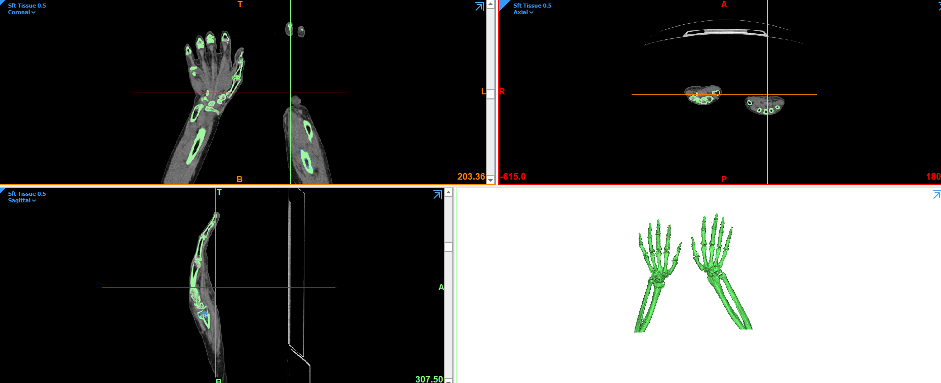

На снимках компьютерной томографии определялась плоскость перелома: По результатам сегментирования определялась условная плоскость перелома по трем выступающим вершинам суставной поверхности определялась суставная плоскость определялась по трем точкам.

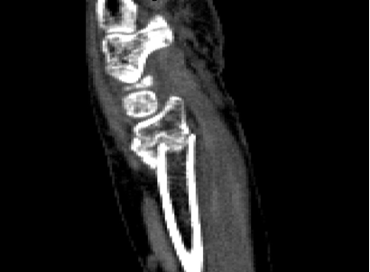

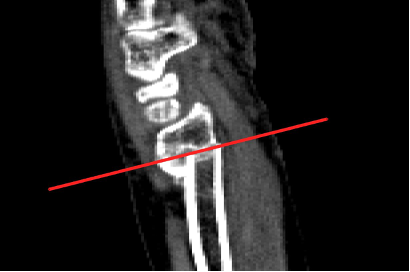

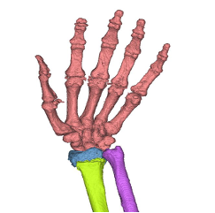

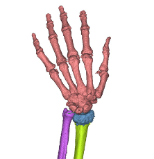

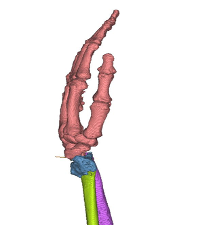

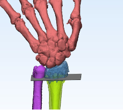

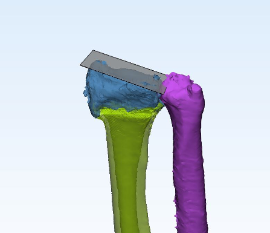

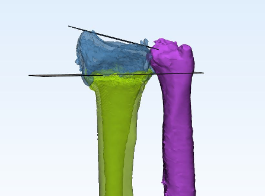

Определялось место и направление планируемой остеотомии по основным правилам.
Остеотомия находилась в зоне изгиба используемой пластины и располагалась ниже линии выхода винтов.
Ориентация производилась одного из винтов в шиловидный отросток.
Линия остеотомии проходила через перелом.
Плоскость остеотомии параллельна суставной плоскости Фиксация планировалась с помощью анатомической фиксирующей ладонной пластинки (Biomet-Zimmer DVR Crosslock Distal Radius Plate), эта пластина была заранее отсканирована и была создана ее виртуальная модель, которая применялась в планировании коррекции лучевой кости.

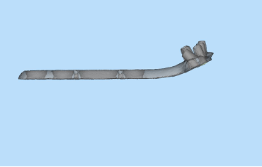

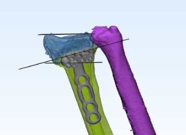

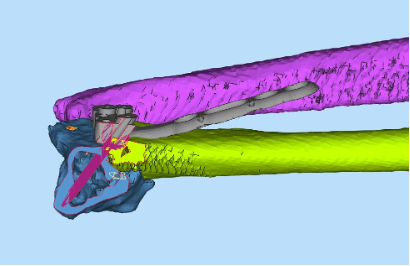

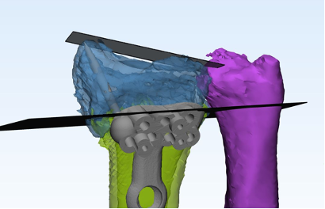

Моделировался хирургический шаблон для позиционирования осцилирующей пилы для того, чтобы шаблон переносил выбранные направления хирургического инструмента.
Учитавались при проектировке его соответствие основным принципам.
Площадь примыкания к кости должна быть минимальна, но в то же время достаточна для неподвижной фиксации на естественных неровностях кости.
Шаблон должен быть закреплен как минимум 2-мя спицами, расположенными так, чтобы не пересекаться с ходом пилы.
При отсутствии возможности сделать полную резекцию под контролем шаблона, допустимо произвести остеотомию не до конца, и продолжить её, убрав шаблон.
это часто связано с тем, что основные неровности на поверхности кости располагаются на линии перелома, через которую и проходит линия остеотомии Для отсутствия контакта пилящего инструмента с непосредственно полимерным направителей был использован дополнительный ручной направитель пилы, он также из стандартного набора инструментов для проведения остеотомии и его виртуальная модель заранее создана с помощью сканера.

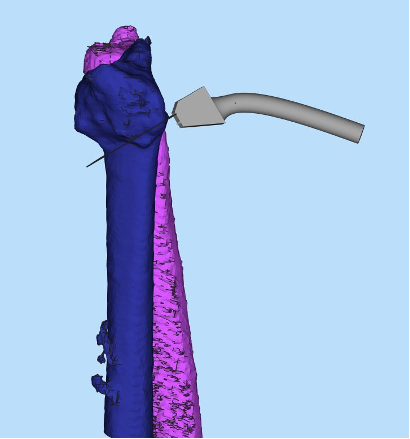

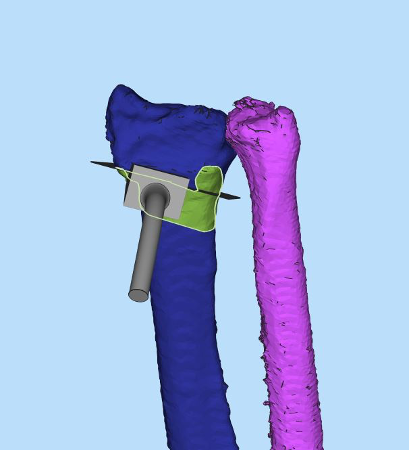


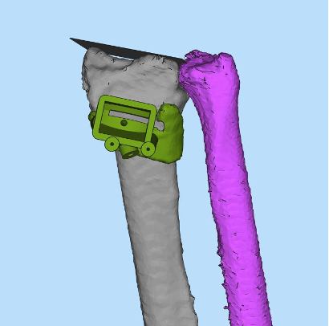

Шаблоны являлись временными и индивидуальными изделиями.
Основная задача любого шаблона – это перенос запрограммированных данных из программы по 3d планированию в условия реальной операции, что требовалось проверить в рамках настоящего исследования.
Для печати использовалась технология технология стереолитографии.
Используемые материалы имели регистрационные удостоверения для применения в медицине.
Мы выбрали производителя Harz Labs, материал dental yellow clear.
Жидкая фотополимерная смола стоматологического применения, для изготовления хирургических шаблонов при установке имплантатов.
Использовался 3d принтер photon mono x6.
Напечатанный индивидуальный шаблон-направитель отправлялся в стерилизацию.

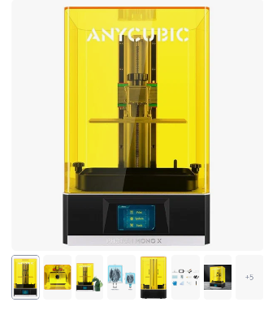

## 2.3 Характеристика выборок по этапам

Далее будут подробно описаны все изучаемые группы последовательно по этапам.

### 2.3.1 Ретроспективная оценка результатов остетомии ЛК при неправильном сращении дистального метаэпифиза лучевой кости

*Описание всей ретроспективной выборки*

Медиана время с момента опрерации пациентов во всей ретроспективной выборке 3 [Q1-Q3: 3;4] лет.
Медиана возраст пациентов во всей ретроспективной выборке 58 [Q1-Q3: 41.25;62.75] лет.
Медиана ИМТ пациентов во всей ретроспективной выборке 24.13 [Q1-Q3: 20.71;27.19] кг/м2.
Медиана НЛК поврежденной руки пациентов во всей ретроспективной выборке 8.78 [Q1-Q3: 6.17;13.65] градусов.
Медиана ЛН поврежденной рукипациентов во всей ретроспективной выборке 7.76 [Q1-Q3: 5.91;27.98] градусов.
Медиана ЛВ поврежденной рукипациентов во всей ретроспективной выборке 5.64 [Q1-Q3: 4.45;6.66] градусов.
Медиана НЛК неповрежденной руки пациентов во всей ретроспективной выборке 25 [Q1-Q3: 15;28] градусов.
Медиана ЛН неповрежденной рукипациентов во всей ретроспективной выборке 12 [Q1-Q3: 11;13] градусов.
Медиана ЛВ неповрежденной рукипациентов во всей ретроспективной выборке 10 [Q1-Q3: 9;11] градусов.

Таблица № 2.n.
Показатели\
время с момента опрерации\
возраст\
ИМТ\
НЛК поврежденной руки\
ЛН поврежденной руки ЛВ поврежденной руки НЛК неповрежденной руки\
ЛН неповрежденной руки ЛВ неповрежденной руки пациентов во всей ретроспективной выборке

| Показатель                | Количество                     | Единица измерения |
|---------------------------|--------------------------------|-------------------|
| время с момента опрерации | 3 [ Q1-Q3: 3 ; 4 ]             | лет               |
| возраст                   | 58 [ Q1-Q3: 41.25 ; 62.75 ]    | лет               |
| ИМТ                       | 24.13 [ Q1-Q3: 20.71 ; 27.19 ] | кг/м2             |
| НЛК поврежденной руки     | 8.78 [ Q1-Q3: 6.17 ; 13.65 ]   | градусов          |
| ЛН поврежденной руки      | 7.76 [ Q1-Q3: 5.91 ; 27.98 ]   | градусов          |
| ЛВ поврежденной руки      | 5.64 [ Q1-Q3: 4.45 ; 6.66 ]    | градусов          |
| НЛК неповрежденной руки   | 25 [ Q1-Q3: 15 ; 28 ]          | градусов          |
| ЛН неповрежденной руки    | 12 [ Q1-Q3: 11 ; 13 ]          | градусов          |
| ЛВ неповрежденной руки    | 10 [ Q1-Q3: 9 ; 11 ]           | градусов          |

Пол пациентов во всей ретроспективной выборке Женский в 69.57% (32/46случаев)[95% ДИ 0.54;0.82].
Мужской в 30.43% (14/46случаев)[95% ДИ 0.18;0.46].

Сторона поражения пациентов во всей ретроспективной выборке Левая в 45.65% (21/46случаев)[95% ДИ 0.31;0.61].
Правая в 54.35% (25/46случаев)[95% ДИ 0.39;0.69].

Доминирующая рука пациентов во всей ретроспективной выборке Левая в 21.74% (10/46случаев)[95% ДИ 0.11;0.37].
Правая в 78.26% (36/46случаев)[95% ДИ 0.63;0.89].

Повреждение доминирующей руки пациентов во всей ретроспективной выборке Да в 71.74% (33/46случаев)[95% ДИ 0.56;0.84].
Нет в 28.26% (13/46случаев)[95% ДИ 0.16;0.44].

Тип деформации пациентов во всей ретроспективной выборке Дорсальная в 41.3% (19/46случаев)[95% ДИ 0.27;0.57].
Ладонная в 58.7% (27/46случаев)[95% ДИ 0.43;0.73].

Тип Активности пациентов во всей ретроспективной выборке Смешанный в 32.61% (15/46случаев)[95% ДИ 0.2;0.48].
Ручной в 19.57% (9/46случаев)[95% ДИ 0.1;0.34].
Пенсионер в 47.83% (22/46случаев)[95% ДИ 0.33;0.63].

Категория НЛК поврежденной руки пациентов во всей ретроспективной выборке Меньше в 78.26% (36/46случаев)[95% ДИ 0.63;0.89].
Норма в 21.74% (10/46случаев)[95% ДИ 0.11;0.37].
Больше в 0% (0/46случаев)[95% ДИ 0;0.1].

Категория ЛН поврежденной руки пациентов во всей ретроспективной выборке Меньше в 63.04% (29/46случаев)[95% ДИ 0.48;0.76].
Норма в 0% (0/46случаев)[95% ДИ 0;0.1].
Больше в 36.96% (17/46случаев)[95% ДИ 0.24;0.52].

Категория ЛВ поврежденной руки пациентов во всей ретроспективной выборке Меньше в 100% (46/46случаев)[95% ДИ 0.9;1].
Норма в 0% (0/46случаев)[95% ДИ 0;0.1].
Больше в 0% (0/46случаев)[95% ДИ 0;0.1].

Категория НЛК неповрежденной руки\
пациентов во всей ретроспективной выборке Меньше в 19.57% (9/46случаев)[95% ДИ 0.1;0.34].
Норма в 34.78% (16/46случаев)[95% ДИ 0.22;0.5].
Больше в 45.65% (21/46случаев)[95% ДИ 0.31;0.61].

Категория ЛН неповрежденной руки пациентов во всей ретроспективной выборке Меньше в 0% (0/46случаев)[95% ДИ 0;0.1].
Норма в 100% (46/46случаев)[95% ДИ 0.9;1].
Больше в 0% (0/46случаев)[95% ДИ 0;0.1].

Категория ЛВ неповрежденной руки пациентов во всей ретроспективной выборке Меньше в 0% (0/46случаев)[95% ДИ 0;0.1].
Норма в 93.48% (43/46случаев)[95% ДИ 0.81;0.98].
Больше в 6.52% (3/46случаев)[95% ДИ 0.02;0.19].

Таблица № 2.n.
Показатели\
Пол Сторона поражения Доминирующая рука Повреждение доминирующей руки Тип деформации Тип Активности Категория НЛК поврежденной руки Категория ЛН поврежденной руки Категория ЛВ поврежденной руки Категория НЛК неповрежденной руки\
Категория ЛН неповрежденной руки Категория ЛВ неповрежденной руки пациентов во всей ретроспективной выборке

| Показатель                        | Процентная доля          | ДИ                    | p-value |
|-----------------------------------|--------------------------|-----------------------|---------|
| Пол                               | ------                   | ------                | ------  |
| Женский                           | 70 % ( 32 / 46 случаев)  | [95% ДИ 0.54 ; 0.82 ] |         |
| Мужской                           | 30 % ( 14 / 46 случаев)  | [95% ДИ 0.18 ; 0.46 ] |         |
| Сторона поражения                 | ------                   | ------                | ------  |
| Левая                             | 46 % ( 21 / 46 случаев)  | [95% ДИ 0.31 ; 0.61 ] |         |
| Правая                            | 54 % ( 25 / 46 случаев)  | [95% ДИ 0.39 ; 0.69 ] |         |
| Доминирующая рука                 | ------                   | ------                | ------  |
| Левая                             | 22 % ( 10 / 46 случаев)  | [95% ДИ 0.11 ; 0.37 ] |         |
| Правая                            | 78 % ( 36 / 46 случаев)  | [95% ДИ 0.63 ; 0.89 ] |         |
| Повреждение доминирующей руки     | ------                   | ------                | ------  |
| Да                                | 72 % ( 33 / 46 случаев)  | [95% ДИ 0.56 ; 0.84 ] |         |
| Нет                               | 28 % ( 13 / 46 случаев)  | [95% ДИ 0.16 ; 0.44 ] |         |
| Тип деформации                    | ------                   | ------                | ------  |
| Дорсальная                        | 41 % ( 19 / 46 случаев)  | [95% ДИ 0.27 ; 0.57 ] |         |
| Ладонная                          | 59 % ( 27 / 46 случаев)  | [95% ДИ 0.43 ; 0.73 ] |         |
| Тип Активности                    | ------                   | ------                | ------  |
| Смешанный                         | 33 % ( 15 / 46 случаев)  | [95% ДИ 0.2 ; 0.48 ]  |         |
| Ручной                            | 20 % ( 9 / 46 случаев)   | [95% ДИ 0.1 ; 0.34 ]  |         |
| Пенсионер                         | 48 % ( 22 / 46 случаев)  | [95% ДИ 0.33 ; 0.63 ] |         |
| Категория НЛК поврежденной руки   | ------                   | ------                | ------  |
| Меньше                            | 78 % ( 36 / 46 случаев)  | [95% ДИ 0.63 ; 0.89 ] |         |
| Норма                             | 22 % ( 10 / 46 случаев)  | [95% ДИ 0.11 ; 0.37 ] |         |
| Больше                            | 0 % ( 0 / 46 случаев)    | [95% ДИ 0 ; 0.1 ]     |         |
| Категория ЛН поврежденной руки    | ------                   | ------                | ------  |
| Меньше                            | 63 % ( 29 / 46 случаев)  | [95% ДИ 0.48 ; 0.76 ] |         |
| Норма                             | 0 % ( 0 / 46 случаев)    | [95% ДИ 0 ; 0.1 ]     |         |
| Больше                            | 37 % ( 17 / 46 случаев)  | [95% ДИ 0.24 ; 0.52 ] |         |
| Категория ЛВ поврежденной руки    | ------                   | ------                | ------  |
| Меньше                            | 100 % ( 46 / 46 случаев) | [95% ДИ 0.9 ; 1 ]     |         |
| Норма                             | 0 % ( 0 / 46 случаев)    | [95% ДИ 0 ; 0.1 ]     |         |
| Больше                            | 0 % ( 0 / 46 случаев)    | [95% ДИ 0 ; 0.1 ]     |         |
| Категория НЛК неповрежденной руки | ------                   | ------                | ------  |
| Меньше                            | 20 % ( 9 / 46 случаев)   | [95% ДИ 0.1 ; 0.34 ]  |         |
| Норма                             | 35 % ( 16 / 46 случаев)  | [95% ДИ 0.22 ; 0.5 ]  |         |
| Больше                            | 46 % ( 21 / 46 случаев)  | [95% ДИ 0.31 ; 0.61 ] |         |
| Категория ЛН неповрежденной руки  | ------                   | ------                | ------  |
| Меньше                            | 0 % ( 0 / 46 случаев)    | [95% ДИ 0 ; 0.1 ]     |         |
| Норма                             | 100 % ( 46 / 46 случаев) | [95% ДИ 0.9 ; 1 ]     |         |
| Больше                            | 0 % ( 0 / 46 случаев)    | [95% ДИ 0 ; 0.1 ]     |         |
| Категория ЛВ неповрежденной руки  | ------                   | ------                | ------  |
| Меньше                            | 0 % ( 0 / 46 случаев)    | [95% ДИ 0 ; 0.1 ]     |         |
| Норма                             | 93 % ( 43 / 46 случаев)  | [95% ДИ 0.81 ; 0.98 ] |         |
| Больше                            | 7 % ( 3 / 46 случаев)    | [95% ДИ 0.02 ; 0.19 ] |         |

*Описание подгруппы пациентов с повреждением доминирующей руки*

Медиана время с момента опрерации подгруппы пациентов с повреждением доминирующей руки 3 [Q1-Q3: 3;4] лет.
Медиана возраст подгруппы пациентов с повреждением доминирующей руки 54 [Q1-Q3: 45;62] лет.
Медиана ИМТ подгруппы пациентов с повреждением доминирующей руки 24.83 [Q1-Q3: 20.71;27.2] кг/м2.
Средний НЛК поврежденной руки подгруппы пациентов с повреждением доминирующей руки 8.54±5.31 градусов.
Медиана ЛН поврежденной рукиподгруппы пациентов с повреждением доминирующей руки 7.37 [Q1-Q3: 4.67;27.01] градусов.
Медиана ЛВ поврежденной рукиподгруппы пациентов с повреждением доминирующей руки 5.64 [Q1-Q3: 4.45;6.66] градусов.
Медиана НЛК неповрежденной руки подгруппы пациентов с повреждением доминирующей руки 25 [Q1-Q3: 16;28] градусов.
Медиана ЛН неповрежденной рукиподгруппы пациентов с повреждением доминирующей руки 12 [Q1-Q3: 11;12] градусов.
Медиана ЛВ неповрежденной рукиподгруппы пациентов с повреждением доминирующей руки 10 [Q1-Q3: 9;11] градусов.

Таблица № 2.n.
Показатели\
время с момента опрерации\
возраст\
ИМТ\
НЛК поврежденной руки\
ЛН поврежденной руки ЛВ поврежденной руки НЛК неповрежденной руки\
ЛН неповрежденной руки ЛВ неповрежденной руки подгруппы пациентов с повреждением доминирующей руки

| Показатель                | Количество                    | Единица измерения |
|---------------------------|-------------------------------|-------------------|
| время с момента опрерации | 3 [ Q1-Q3: 3 ; 4 ]            | лет               |
| возраст                   | 54 [ Q1-Q3: 45 ; 62 ]         | лет               |
| ИМТ                       | 24.83 [ Q1-Q3: 20.71 ; 27.2 ] | кг/м2             |
| НЛК поврежденной руки     | 8.54 ± 5.31                   | градусов          |
| ЛН поврежденной руки      | 7.37 [ Q1-Q3: 4.67 ; 27.01 ]  | градусов          |
| ЛВ поврежденной руки      | 5.64 [ Q1-Q3: 4.45 ; 6.66 ]   | градусов          |
| НЛК неповрежденной руки   | 25 [ Q1-Q3: 16 ; 28 ]         | градусов          |
| ЛН неповрежденной руки    | 12 [ Q1-Q3: 11 ; 12 ]         | градусов          |
| ЛВ неповрежденной руки    | 10 [ Q1-Q3: 9 ; 11 ]          | градусов          |

Пол подгруппы пациентов с повреждением доминирующей руки Женский в 66.67% (22/33случаев)[95% ДИ 0.48;0.81].
Мужской в 33.33% (11/33случаев)[95% ДИ 0.19;0.52].

Сторона поражения подгруппы пациентов с повреждением доминирующей руки Левая в 27.27% (9/33случаев)[95% ДИ 0.14;0.46].
Правая в 72.73% (24/33случаев)[95% ДИ 0.54;0.86].

Доминирующая рука подгруппы пациентов с повреждением доминирующей руки Левая в 27.27% (9/33случаев)[95% ДИ 0.14;0.46].
Правая в 72.73% (24/33случаев)[95% ДИ 0.54;0.86].

Повреждение доминирующей руки подгруппы пациентов с повреждением доминирующей руки Да в 100% (33/33случаев)[95% ДИ 0.87;1].
Нет в 0% (0/33случаев)[95% ДИ 0;0.13].

Тип деформации подгруппы пациентов с повреждением доминирующей руки Дорсальная в 45.45% (15/33случаев)[95% ДИ 0.29;0.63].
Ладонная в 54.55% (18/33случаев)[95% ДИ 0.37;0.71].

Тип Активности подгруппы пациентов с повреждением доминирующей руки Смешанный в 36.36% (12/33случаев)[95% ДИ 0.21;0.55].
Ручной в 18.18% (6/33случаев)[95% ДИ 0.08;0.36].
Пенсионер в 45.45% (15/33случаев)[95% ДИ 0.29;0.63].

Категория НЛК поврежденной руки подгруппы пациентов с повреждением доминирующей руки Меньше в 78.79% (26/33случаев)[95% ДИ 0.61;0.9].
Норма в 21.21% (7/33случаев)[95% ДИ 0.1;0.39].
Больше в 0% (0/33случаев)[95% ДИ 0;0.13].

Категория ЛН поврежденной руки подгруппы пациентов с повреждением доминирующей руки Меньше в 66.67% (22/33случаев)[95% ДИ 0.48;0.81].
Норма в 0% (0/33случаев)[95% ДИ 0;0.13].
Больше в 33.33% (11/33случаев)[95% ДИ 0.19;0.52].

Категория ЛВ поврежденной руки подгруппы пациентов с повреждением доминирующей руки Меньше в 100% (33/33случаев)[95% ДИ 0.87;1].
Норма в 0% (0/33случаев)[95% ДИ 0;0.13].
Больше в 0% (0/33случаев)[95% ДИ 0;0.13].

Категория НЛК неповрежденной руки\
подгруппы пациентов с повреждением доминирующей руки Меньше в 15.15% (5/33случаев)[95% ДИ 0.06;0.33].
Норма в 39.39% (13/33случаев)[95% ДИ 0.23;0.58].
Больше в 45.45% (15/33случаев)[95% ДИ 0.29;0.63].

Категория ЛН неповрежденной руки подгруппы пациентов с повреждением доминирующей руки Меньше в 0% (0/33случаев)[95% ДИ 0;0.13].
Норма в 100% (33/33случаев)[95% ДИ 0.87;1].
Больше в 0% (0/33случаев)[95% ДИ 0;0.13].

Категория ЛВ неповрежденной руки подгруппы пациентов с повреждением доминирующей руки Меньше в 0% (0/33случаев)[95% ДИ 0;0.13].
Норма в 100% (33/33случаев)[95% ДИ 0.87;1].
Больше в 0% (0/33случаев)[95% ДИ 0;0.13].

Таблица № 2.n.
Показатели\
Пол Сторона поражения Доминирующая рука Повреждение доминирующей руки Тип деформации Тип Активности Категория НЛК поврежденной руки Категория ЛН поврежденной руки Категория ЛВ поврежденной руки Категория НЛК неповрежденной руки\
Категория ЛН неповрежденной руки Категория ЛВ неповрежденной руки подгруппы пациентов с повреждением доминирующей руки

| Показатель                        | Процентная доля          | ДИ                    | p-value |
|-----------------------------------|--------------------------|-----------------------|---------|
| Пол                               | ------                   | ------                | ------  |
| Женский                           | 67 % ( 22 / 33 случаев)  | [95% ДИ 0.48 ; 0.81 ] |         |
| Мужской                           | 33 % ( 11 / 33 случаев)  | [95% ДИ 0.19 ; 0.52 ] |         |
| Сторона поражения                 | ------                   | ------                | ------  |
| Левая                             | 27 % ( 9 / 33 случаев)   | [95% ДИ 0.14 ; 0.46 ] |         |
| Правая                            | 73 % ( 24 / 33 случаев)  | [95% ДИ 0.54 ; 0.86 ] |         |
| Доминирующая рука                 | ------                   | ------                | ------  |
| Левая                             | 27 % ( 9 / 33 случаев)   | [95% ДИ 0.14 ; 0.46 ] |         |
| Правая                            | 73 % ( 24 / 33 случаев)  | [95% ДИ 0.54 ; 0.86 ] |         |
| Повреждение доминирующей руки     | ------                   | ------                | ------  |
| Да                                | 100 % ( 33 / 33 случаев) | [95% ДИ 0.87 ; 1 ]    |         |
| Нет                               | 0 % ( 0 / 33 случаев)    | [95% ДИ 0 ; 0.13 ]    |         |
| Тип деформации                    | ------                   | ------                | ------  |
| Дорсальная                        | 45 % ( 15 / 33 случаев)  | [95% ДИ 0.29 ; 0.63 ] |         |
| Ладонная                          | 55 % ( 18 / 33 случаев)  | [95% ДИ 0.37 ; 0.71 ] |         |
| Тип Активности                    | ------                   | ------                | ------  |
| Смешанный                         | 36 % ( 12 / 33 случаев)  | [95% ДИ 0.21 ; 0.55 ] |         |
| Ручной                            | 18 % ( 6 / 33 случаев)   | [95% ДИ 0.08 ; 0.36 ] |         |
| Пенсионер                         | 45 % ( 15 / 33 случаев)  | [95% ДИ 0.29 ; 0.63 ] |         |
| Категория НЛК поврежденной руки   | ------                   | ------                | ------  |
| Меньше                            | 79 % ( 26 / 33 случаев)  | [95% ДИ 0.61 ; 0.9 ]  |         |
| Норма                             | 21 % ( 7 / 33 случаев)   | [95% ДИ 0.1 ; 0.39 ]  |         |
| Больше                            | 0 % ( 0 / 33 случаев)    | [95% ДИ 0 ; 0.13 ]    |         |
| Категория ЛН поврежденной руки    | ------                   | ------                | ------  |
| Меньше                            | 67 % ( 22 / 33 случаев)  | [95% ДИ 0.48 ; 0.81 ] |         |
| Норма                             | 0 % ( 0 / 33 случаев)    | [95% ДИ 0 ; 0.13 ]    |         |
| Больше                            | 33 % ( 11 / 33 случаев)  | [95% ДИ 0.19 ; 0.52 ] |         |
| Категория ЛВ поврежденной руки    | ------                   | ------                | ------  |
| Меньше                            | 100 % ( 33 / 33 случаев) | [95% ДИ 0.87 ; 1 ]    |         |
| Норма                             | 0 % ( 0 / 33 случаев)    | [95% ДИ 0 ; 0.13 ]    |         |
| Больше                            | 0 % ( 0 / 33 случаев)    | [95% ДИ 0 ; 0.13 ]    |         |
| Категория НЛК неповрежденной руки | ------                   | ------                | ------  |
| Меньше                            | 15 % ( 5 / 33 случаев)   | [95% ДИ 0.06 ; 0.33 ] |         |
| Норма                             | 39 % ( 13 / 33 случаев)  | [95% ДИ 0.23 ; 0.58 ] |         |
| Больше                            | 45 % ( 15 / 33 случаев)  | [95% ДИ 0.29 ; 0.63 ] |         |
| Категория ЛН неповрежденной руки  | ------                   | ------                | ------  |
| Меньше                            | 0 % ( 0 / 33 случаев)    | [95% ДИ 0 ; 0.13 ]    |         |
| Норма                             | 100 % ( 33 / 33 случаев) | [95% ДИ 0.87 ; 1 ]    |         |
| Больше                            | 0 % ( 0 / 33 случаев)    | [95% ДИ 0 ; 0.13 ]    |         |
| Категория ЛВ неповрежденной руки  | ------                   | ------                | ------  |
| Меньше                            | 0 % ( 0 / 33 случаев)    | [95% ДИ 0 ; 0.13 ]    |         |
| Норма                             | 100 % ( 33 / 33 случаев) | [95% ДИ 0.87 ; 1 ]    |         |
| Больше                            | 0 % ( 0 / 33 случаев)    | [95% ДИ 0 ; 0.13 ]    |         |

*Описание подгруппы пациентов с повреждением недоминирующей руки*

Средний время с момента опрерации подгруппы пациентов с повреждением недоминирующей руки 3.31±0.85 лет.
Медиана возраст подгруппы пациентов с повреждением недоминирующей руки 60 [Q1-Q3: 40;63] лет.
Средний ИМТ подгруппы пациентов с повреждением недоминирующей руки 24.23±3.57 кг/м2.
Средний НЛК поврежденной руки подгруппы пациентов с повреждением недоминирующей руки 10.57±4.23 градусов.
Медиана ЛН поврежденной рукиподгруппы пациентов с повреждением недоминирующей руки 7.76 [Q1-Q3: 6.47;32.97] градусов.
Медиана ЛВ поврежденной рукиподгруппы пациентов с повреждением недоминирующей руки 4.73 [Q1-Q3: 4.67;6.66] градусов.
Медиана НЛК неповрежденной руки подгруппы пациентов с повреждением недоминирующей руки 16 [Q1-Q3: 14;28] градусов.
Медиана ЛН неповрежденной рукиподгруппы пациентов с повреждением недоминирующей руки 12 [Q1-Q3: 12;17] градусов.
Медиана ЛВ неповрежденной рукиподгруппы пациентов с повреждением недоминирующей руки 10 [Q1-Q3: 9;12] градусов.

Таблица № 2.n.
Показатели\
время с момента опрерации\
возраст\
ИМТ\
НЛК поврежденной руки\
ЛН поврежденной руки ЛВ поврежденной руки НЛК неповрежденной руки\
ЛН неповрежденной руки ЛВ неповрежденной руки подгруппы пациентов с повреждением недоминирующей руки

| Показатель                | Количество                   | Единица измерения |
|---------------------------|------------------------------|-------------------|
| время с момента опрерации | 3.31 ± 0.85                  | лет               |
| возраст                   | 60 [ Q1-Q3: 40 ; 63 ]        | лет               |
| ИМТ                       | 24.23 ± 3.57                 | кг/м2             |
| НЛК поврежденной руки     | 10.57 ± 4.23                 | градусов          |
| ЛН поврежденной руки      | 7.76 [ Q1-Q3: 6.47 ; 32.97 ] | градусов          |
| ЛВ поврежденной руки      | 4.73 [ Q1-Q3: 4.67 ; 6.66 ]  | градусов          |
| НЛК неповрежденной руки   | 16 [ Q1-Q3: 14 ; 28 ]        | градусов          |
| ЛН неповрежденной руки    | 12 [ Q1-Q3: 12 ; 17 ]        | градусов          |
| ЛВ неповрежденной руки    | 10 [ Q1-Q3: 9 ; 12 ]         | градусов          |

Пол подгруппы пациентов с повреждением недоминирующей руки Женский в 76.92% (10/13случаев)[95% ДИ 0.46;0.94].
Мужской в 23.08% (3/13случаев)[95% ДИ 0.06;0.54].

Сторона поражения подгруппы пациентов с повреждением недоминирующей руки Левая в 92.31% (12/13случаев)[95% ДИ 0.62;1].
Правая в 7.69% (1/13случаев)[95% ДИ 0;0.38].

Доминирующая рука подгруппы пациентов с повреждением недоминирующей руки Левая в 7.69% (1/13случаев)[95% ДИ 0;0.38].
Правая в 92.31% (12/13случаев)[95% ДИ 0.62;1].

Повреждение доминирующей руки подгруппы пациентов с повреждением недоминирующей руки Да в 0% (0/13случаев)[95% ДИ 0;0.28].
Нет в 100% (13/13случаев)[95% ДИ 0.72;1].

Тип деформации подгруппы пациентов с повреждением недоминирующей руки Дорсальная в 30.77% (4/13случаев)[95% ДИ 0.1;0.61].
Ладонная в 69.23% (9/13случаев)[95% ДИ 0.39;0.9].

Тип Активности подгруппы пациентов с повреждением недоминирующей руки Смешанный в 23.08% (3/13случаев)[95% ДИ 0.06;0.54].
Ручной в 23.08% (3/13случаев)[95% ДИ 0.06;0.54].
Пенсионер в 53.85% (7/13случаев)[95% ДИ 0.26;0.8].

Категория НЛК поврежденной руки подгруппы пациентов с повреждением недоминирующей руки Меньше в 76.92% (10/13случаев)[95% ДИ 0.46;0.94].
Норма в 23.08% (3/13случаев)[95% ДИ 0.06;0.54].
Больше в 0% (0/13случаев)[95% ДИ 0;0.28].

Категория ЛН поврежденной руки подгруппы пациентов с повреждением недоминирующей руки Меньше в 53.85% (7/13случаев)[95% ДИ 0.26;0.8].
Норма в 0% (0/13случаев)[95% ДИ 0;0.28].
Больше в 46.15% (6/13случаев)[95% ДИ 0.2;0.74].

Категория ЛВ поврежденной руки подгруппы пациентов с повреждением недоминирующей руки Меньше в 100% (13/13случаев)[95% ДИ 0.72;1].
Норма в 0% (0/13случаев)[95% ДИ 0;0.28].
Больше в 0% (0/13случаев)[95% ДИ 0;0.28].

Категория НЛК неповрежденной руки\
подгруппы пациентов с повреждением недоминирующей руки Меньше в 30.77% (4/13случаев)[95% ДИ 0.1;0.61].
Норма в 23.08% (3/13случаев)[95% ДИ 0.06;0.54].
Больше в 46.15% (6/13случаев)[95% ДИ 0.2;0.74].

Категория ЛН неповрежденной руки подгруппы пациентов с повреждением недоминирующей руки Меньше в 0% (0/13случаев)[95% ДИ 0;0.28].
Норма в 100% (13/13случаев)[95% ДИ 0.72;1].
Больше в 0% (0/13случаев)[95% ДИ 0;0.28].

Категория ЛВ неповрежденной руки подгруппы пациентов с повреждением недоминирующей руки Меньше в 0% (0/13случаев)[95% ДИ 0;0.28].
Норма в 76.92% (10/13случаев)[95% ДИ 0.46;0.94].
Больше в 23.08% (3/13случаев)[95% ДИ 0.06;0.54].

Таблица № 2.n.
Показатели\
Пол Сторона поражения Доминирующая рука Повреждение доминирующей руки Тип деформации Тип Активности Категория НЛК поврежденной руки Категория ЛН поврежденной руки Категория ЛВ поврежденной руки Категория НЛК неповрежденной руки\
Категория ЛН неповрежденной руки Категория ЛВ неповрежденной руки подгруппы пациентов с повреждением недоминирующей руки

| Показатель                        | Процентная доля          | ДИ                    | p-value |
|-----------------------------------|--------------------------|-----------------------|---------|
| Пол                               | ------                   | ------                | ------  |
| Женский                           | 77 % ( 10 / 13 случаев)  | [95% ДИ 0.46 ; 0.94 ] |         |
| Мужской                           | 23 % ( 3 / 13 случаев)   | [95% ДИ 0.06 ; 0.54 ] |         |
| Сторона поражения                 | ------                   | ------                | ------  |
| Левая                             | 92 % ( 12 / 13 случаев)  | [95% ДИ 0.62 ; 1 ]    |         |
| Правая                            | 8 % ( 1 / 13 случаев)    | [95% ДИ 0 ; 0.38 ]    |         |
| Доминирующая рука                 | ------                   | ------                | ------  |
| Левая                             | 8 % ( 1 / 13 случаев)    | [95% ДИ 0 ; 0.38 ]    |         |
| Правая                            | 92 % ( 12 / 13 случаев)  | [95% ДИ 0.62 ; 1 ]    |         |
| Повреждение доминирующей руки     | ------                   | ------                | ------  |
| Да                                | 0 % ( 0 / 13 случаев)    | [95% ДИ 0 ; 0.28 ]    |         |
| Нет                               | 100 % ( 13 / 13 случаев) | [95% ДИ 0.72 ; 1 ]    |         |
| Тип деформации                    | ------                   | ------                | ------  |
| Дорсальная                        | 31 % ( 4 / 13 случаев)   | [95% ДИ 0.1 ; 0.61 ]  |         |
| Ладонная                          | 69 % ( 9 / 13 случаев)   | [95% ДИ 0.39 ; 0.9 ]  |         |
| Тип Активности                    | ------                   | ------                | ------  |
| Смешанный                         | 23 % ( 3 / 13 случаев)   | [95% ДИ 0.06 ; 0.54 ] |         |
| Ручной                            | 23 % ( 3 / 13 случаев)   | [95% ДИ 0.06 ; 0.54 ] |         |
| Пенсионер                         | 54 % ( 7 / 13 случаев)   | [95% ДИ 0.26 ; 0.8 ]  |         |
| Категория НЛК поврежденной руки   | ------                   | ------                | ------  |
| Меньше                            | 77 % ( 10 / 13 случаев)  | [95% ДИ 0.46 ; 0.94 ] |         |
| Норма                             | 23 % ( 3 / 13 случаев)   | [95% ДИ 0.06 ; 0.54 ] |         |
| Больше                            | 0 % ( 0 / 13 случаев)    | [95% ДИ 0 ; 0.28 ]    |         |
| Категория ЛН поврежденной руки    | ------                   | ------                | ------  |
| Меньше                            | 54 % ( 7 / 13 случаев)   | [95% ДИ 0.26 ; 0.8 ]  |         |
| Норма                             | 0 % ( 0 / 13 случаев)    | [95% ДИ 0 ; 0.28 ]    |         |
| Больше                            | 46 % ( 6 / 13 случаев)   | [95% ДИ 0.2 ; 0.74 ]  |         |
| Категория ЛВ поврежденной руки    | ------                   | ------                | ------  |
| Меньше                            | 100 % ( 13 / 13 случаев) | [95% ДИ 0.72 ; 1 ]    |         |
| Норма                             | 0 % ( 0 / 13 случаев)    | [95% ДИ 0 ; 0.28 ]    |         |
| Больше                            | 0 % ( 0 / 13 случаев)    | [95% ДИ 0 ; 0.28 ]    |         |
| Категория НЛК неповрежденной руки | ------                   | ------                | ------  |
| Меньше                            | 31 % ( 4 / 13 случаев)   | [95% ДИ 0.1 ; 0.61 ]  |         |
| Норма                             | 23 % ( 3 / 13 случаев)   | [95% ДИ 0.06 ; 0.54 ] |         |
| Больше                            | 46 % ( 6 / 13 случаев)   | [95% ДИ 0.2 ; 0.74 ]  |         |
| Категория ЛН неповрежденной руки  | ------                   | ------                | ------  |
| Меньше                            | 0 % ( 0 / 13 случаев)    | [95% ДИ 0 ; 0.28 ]    |         |
| Норма                             | 100 % ( 13 / 13 случаев) | [95% ДИ 0.72 ; 1 ]    |         |
| Больше                            | 0 % ( 0 / 13 случаев)    | [95% ДИ 0 ; 0.28 ]    |         |
| Категория ЛВ неповрежденной руки  | ------                   | ------                | ------  |
| Меньше                            | 0 % ( 0 / 13 случаев)    | [95% ДИ 0 ; 0.28 ]    |         |
| Норма                             | 77 % ( 10 / 13 случаев)  | [95% ДИ 0.46 ; 0.94 ] |         |
| Больше                            | 23 % ( 3 / 13 случаев)   | [95% ДИ 0.06 ; 0.54 ] |         |

*Описание подгруппы пациентов ладонной деформации*

Медиана время с момента опрерации подгруппы пациентов ладонной деформации 3 [Q1-Q3: 3;4] лет.
Медиана возраст подгруппы пациентов ладонной деформации 60 [Q1-Q3: 47;63] лет.
Медиана ИМТ подгруппы пациентов ладонной деформации 25.06 [Q1-Q3: 21.88;27.65] кг/м2.
Средний НЛК поврежденной руки подгруппы пациентов ладонной деформации 8.61±5.13 градусов.
Медиана ЛН поврежденной рукиподгруппы пациентов ладонной деформации 27.01 [Q1-Q3: 9.89;32.97] градусов.
Медиана ЛВ поврежденной рукиподгруппы пациентов ладонной деформации 5.64 [Q1-Q3: 3.54;6.66] градусов.
Медиана НЛК неповрежденной руки подгруппы пациентов ладонной деформации 25 [Q1-Q3: 14;28.5] градусов.
Медиана ЛН неповрежденной рукиподгруппы пациентов ладонной деформации 12 [Q1-Q3: 12;17] градусов.
Медиана ЛВ неповрежденной рукиподгруппы пациентов ладонной деформации 10 [Q1-Q3: 10;11.5] градусов.

Таблица № 2.n.
Показатели\
время с момента опрерации\
возраст\
ИМТ\
НЛК поврежденной руки\
ЛН поврежденной руки ЛВ поврежденной руки НЛК неповрежденной руки\
ЛН неповрежденной руки ЛВ неповрежденной руки подгруппы пациентов ладонной деформации

| Показатель                | Количество                     | Единица измерения |
|---------------------------|--------------------------------|-------------------|
| время с момента опрерации | 3 [ Q1-Q3: 3 ; 4 ]             | лет               |
| возраст                   | 60 [ Q1-Q3: 47 ; 63 ]          | лет               |
| ИМТ                       | 25.06 [ Q1-Q3: 21.88 ; 27.65 ] | кг/м2             |
| НЛК поврежденной руки     | 8.61 ± 5.13                    | градусов          |
| ЛН поврежденной руки      | 27.01 [ Q1-Q3: 9.89 ; 32.97 ]  | градусов          |
| ЛВ поврежденной руки      | 5.64 [ Q1-Q3: 3.54 ; 6.66 ]    | градусов          |
| НЛК неповрежденной руки   | 25 [ Q1-Q3: 14 ; 28.5 ]        | градусов          |
| ЛН неповрежденной руки    | 12 [ Q1-Q3: 12 ; 17 ]          | градусов          |
| ЛВ неповрежденной руки    | 10 [ Q1-Q3: 10 ; 11.5 ]        | градусов          |

Пол подгруппы пациентов ладонной деформации Женский в 66.67% (18/27случаев)[95% ДИ 0.46;0.83].
Мужской в 33.33% (9/27случаев)[95% ДИ 0.17;0.54].

Сторона поражения подгруппы пациентов ладонной деформации Левая в 62.96% (17/27случаев)[95% ДИ 0.42;0.8].
Правая в 37.04% (10/27случаев)[95% ДИ 0.2;0.58].

Доминирующая рука подгруппы пациентов ладонной деформации Левая в 29.63% (8/27случаев)[95% ДИ 0.14;0.5].
Правая в 70.37% (19/27случаев)[95% ДИ 0.5;0.86].

Повреждение доминирующей руки подгруппы пациентов ладонной деформации Да в 66.67% (18/27случаев)[95% ДИ 0.46;0.83].
Нет в 33.33% (9/27случаев)[95% ДИ 0.17;0.54].

Тип деформации подгруппы пациентов ладонной деформации Дорсальная в 0% (0/27случаев)[95% ДИ 0;0.16].
Ладонная в 100% (27/27случаев)[95% ДИ 0.84;1].

Тип Активности подгруппы пациентов ладонной деформации Смешанный в 29.63% (8/27случаев)[95% ДИ 0.14;0.5].
Ручной в 18.52% (5/27случаев)[95% ДИ 0.07;0.39].
Пенсионер в 51.85% (14/27случаев)[95% ДИ 0.32;0.71].

Категория НЛК поврежденной руки подгруппы пациентов ладонной деформации Меньше в 81.48% (22/27случаев)[95% ДИ 0.61;0.93].
Норма в 18.52% (5/27случаев)[95% ДИ 0.07;0.39].
Больше в 0% (0/27случаев)[95% ДИ 0;0.16].

Категория ЛН поврежденной руки подгруппы пациентов ладонной деформации Меньше в 37.04% (10/27случаев)[95% ДИ 0.2;0.58].
Норма в 0% (0/27случаев)[95% ДИ 0;0.16].
Больше в 62.96% (17/27случаев)[95% ДИ 0.42;0.8].

Категория ЛВ поврежденной руки подгруппы пациентов ладонной деформации Меньше в 100% (27/27случаев)[95% ДИ 0.84;1].
Норма в 0% (0/27случаев)[95% ДИ 0;0.16].
Больше в 0% (0/27случаев)[95% ДИ 0;0.16].

Категория НЛК неповрежденной руки\
подгруппы пациентов ладонной деформации Меньше в 33.33% (9/27случаев)[95% ДИ 0.17;0.54].
Норма в 18.52% (5/27случаев)[95% ДИ 0.07;0.39].
Больше в 48.15% (13/27случаев)[95% ДИ 0.29;0.68].

Категория ЛН неповрежденной руки подгруппы пациентов ладонной деформации Меньше в 0% (0/27случаев)[95% ДИ 0;0.16].
Норма в 100% (27/27случаев)[95% ДИ 0.84;1].
Больше в 0% (0/27случаев)[95% ДИ 0;0.16].

Категория ЛВ неповрежденной руки подгруппы пациентов ладонной деформации Меньше в 0% (0/27случаев)[95% ДИ 0;0.16].
Норма в 88.89% (24/27случаев)[95% ДИ 0.7;0.97].
Больше в 11.11% (3/27случаев)[95% ДИ 0.03;0.3].

Таблица № 2.n.
Показатели\
Пол Сторона поражения Доминирующая рука Повреждение доминирующей руки Тип деформации Тип Активности Категория НЛК поврежденной руки Категория ЛН поврежденной руки Категория ЛВ поврежденной руки Категория НЛК неповрежденной руки\
Категория ЛН неповрежденной руки Категория ЛВ неповрежденной руки подгруппы пациентов ладонной деформации

| Показатель                        | Процентная доля          | ДИ                    | p-value |
|-----------------------------------|--------------------------|-----------------------|---------|
| Пол                               | ------                   | ------                | ------  |
| Женский                           | 67 % ( 18 / 27 случаев)  | [95% ДИ 0.46 ; 0.83 ] |         |
| Мужской                           | 33 % ( 9 / 27 случаев)   | [95% ДИ 0.17 ; 0.54 ] |         |
| Сторона поражения                 | ------                   | ------                | ------  |
| Левая                             | 63 % ( 17 / 27 случаев)  | [95% ДИ 0.42 ; 0.8 ]  |         |
| Правая                            | 37 % ( 10 / 27 случаев)  | [95% ДИ 0.2 ; 0.58 ]  |         |
| Доминирующая рука                 | ------                   | ------                | ------  |
| Левая                             | 30 % ( 8 / 27 случаев)   | [95% ДИ 0.14 ; 0.5 ]  |         |
| Правая                            | 70 % ( 19 / 27 случаев)  | [95% ДИ 0.5 ; 0.86 ]  |         |
| Повреждение доминирующей руки     | ------                   | ------                | ------  |
| Да                                | 67 % ( 18 / 27 случаев)  | [95% ДИ 0.46 ; 0.83 ] |         |
| Нет                               | 33 % ( 9 / 27 случаев)   | [95% ДИ 0.17 ; 0.54 ] |         |
| Тип деформации                    | ------                   | ------                | ------  |
| Дорсальная                        | 0 % ( 0 / 27 случаев)    | [95% ДИ 0 ; 0.16 ]    |         |
| Ладонная                          | 100 % ( 27 / 27 случаев) | [95% ДИ 0.84 ; 1 ]    |         |
| Тип Активности                    | ------                   | ------                | ------  |
| Смешанный                         | 30 % ( 8 / 27 случаев)   | [95% ДИ 0.14 ; 0.5 ]  |         |
| Ручной                            | 19 % ( 5 / 27 случаев)   | [95% ДИ 0.07 ; 0.39 ] |         |
| Пенсионер                         | 52 % ( 14 / 27 случаев)  | [95% ДИ 0.32 ; 0.71 ] |         |
| Категория НЛК поврежденной руки   | ------                   | ------                | ------  |
| Меньше                            | 81 % ( 22 / 27 случаев)  | [95% ДИ 0.61 ; 0.93 ] |         |
| Норма                             | 19 % ( 5 / 27 случаев)   | [95% ДИ 0.07 ; 0.39 ] |         |
| Больше                            | 0 % ( 0 / 27 случаев)    | [95% ДИ 0 ; 0.16 ]    |         |
| Категория ЛН поврежденной руки    | ------                   | ------                | ------  |
| Меньше                            | 37 % ( 10 / 27 случаев)  | [95% ДИ 0.2 ; 0.58 ]  |         |
| Норма                             | 0 % ( 0 / 27 случаев)    | [95% ДИ 0 ; 0.16 ]    |         |
| Больше                            | 63 % ( 17 / 27 случаев)  | [95% ДИ 0.42 ; 0.8 ]  |         |
| Категория ЛВ поврежденной руки    | ------                   | ------                | ------  |
| Меньше                            | 100 % ( 27 / 27 случаев) | [95% ДИ 0.84 ; 1 ]    |         |
| Норма                             | 0 % ( 0 / 27 случаев)    | [95% ДИ 0 ; 0.16 ]    |         |
| Больше                            | 0 % ( 0 / 27 случаев)    | [95% ДИ 0 ; 0.16 ]    |         |
| Категория НЛК неповрежденной руки | ------                   | ------                | ------  |
| Меньше                            | 33 % ( 9 / 27 случаев)   | [95% ДИ 0.17 ; 0.54 ] |         |
| Норма                             | 19 % ( 5 / 27 случаев)   | [95% ДИ 0.07 ; 0.39 ] |         |
| Больше                            | 48 % ( 13 / 27 случаев)  | [95% ДИ 0.29 ; 0.68 ] |         |
| Категория ЛН неповрежденной руки  | ------                   | ------                | ------  |
| Меньше                            | 0 % ( 0 / 27 случаев)    | [95% ДИ 0 ; 0.16 ]    |         |
| Норма                             | 100 % ( 27 / 27 случаев) | [95% ДИ 0.84 ; 1 ]    |         |
| Больше                            | 0 % ( 0 / 27 случаев)    | [95% ДИ 0 ; 0.16 ]    |         |
| Категория ЛВ неповрежденной руки  | ------                   | ------                | ------  |
| Меньше                            | 0 % ( 0 / 27 случаев)    | [95% ДИ 0 ; 0.16 ]    |         |
| Норма                             | 89 % ( 24 / 27 случаев)  | [95% ДИ 0.7 ; 0.97 ]  |         |
| Больше                            | 11 % ( 3 / 27 случаев)   | [95% ДИ 0.03 ; 0.3 ]  |         |

*Описание подгруппы пациентов дорсальной деформации*

Медиана время с момента опрерации подгруппы пациентов дорсальной деформации 3 [Q1-Q3: 3;4] лет.
Медиана возраст подгруппы пациентов дорсальной деформации 58 [Q1-Q3: 31;60] лет.
Медиана ИМТ подгруппы пациентов дорсальной деформации 21.97 [Q1-Q3: 20.34;26.88] кг/м2.
Медиана НЛК поврежденной руки подгруппы пациентов дорсальной деформации 9.57 [Q1-Q3: 6.17;14.48] градусов.
Медиана ЛН поврежденной рукиподгруппы пациентов дорсальной деформации 4.67 [Q1-Q3: 3.66;5.91] градусов.
Медиана ЛВ поврежденной рукиподгруппы пациентов дорсальной деформации 4.73 [Q1-Q3: 4.45;5.72] градусов.
Медиана НЛК неповрежденной руки подгруппы пациентов дорсальной деформации 25 [Q1-Q3: 16;26] градусов.
Медиана ЛН неповрежденной рукиподгруппы пациентов дорсальной деформации 10 [Q1-Q3: 10;11] градусов.
Медиана ЛВ неповрежденной рукиподгруппы пациентов дорсальной деформации 9 [Q1-Q3: 9;11] градусов.

Таблица № 2.n.
Показатели\
время с момента опрерации\
возраст\
ИМТ\
НЛК поврежденной руки\
ЛН поврежденной руки ЛВ поврежденной руки НЛК неповрежденной руки\
ЛН неповрежденной руки ЛВ неповрежденной руки подгруппы пациентов дорсальной деформации

| Показатель                | Количество                     | Единица измерения |
|---------------------------|--------------------------------|-------------------|
| время с момента опрерации | 3 [ Q1-Q3: 3 ; 4 ]             | лет               |
| возраст                   | 58 [ Q1-Q3: 31 ; 60 ]          | лет               |
| ИМТ                       | 21.97 [ Q1-Q3: 20.34 ; 26.88 ] | кг/м2             |
| НЛК поврежденной руки     | 9.57 [ Q1-Q3: 6.17 ; 14.48 ]   | градусов          |
| ЛН поврежденной руки      | 4.67 [ Q1-Q3: 3.66 ; 5.91 ]    | градусов          |
| ЛВ поврежденной руки      | 4.73 [ Q1-Q3: 4.45 ; 5.72 ]    | градусов          |
| НЛК неповрежденной руки   | 25 [ Q1-Q3: 16 ; 26 ]          | градусов          |
| ЛН неповрежденной руки    | 10 [ Q1-Q3: 10 ; 11 ]          | градусов          |
| ЛВ неповрежденной руки    | 9 [ Q1-Q3: 9 ; 11 ]            | градусов          |

Пол подгруппы пациентов дорсальной деформации Женский в 73.68% (14/19случаев)[95% ДИ 0.49;0.9].
Мужской в 26.32% (5/19случаев)[95% ДИ 0.1;0.51].

Сторона поражения подгруппы пациентов дорсальной деформации Левая в 21.05% (4/19случаев)[95% ДИ 0.07;0.46].
Правая в 78.95% (15/19случаев)[95% ДИ 0.54;0.93].

Доминирующая рука подгруппы пациентов дорсальной деформации Левая в 10.53% (2/19случаев)[95% ДИ 0.02;0.35].
Правая в 89.47% (17/19случаев)[95% ДИ 0.65;0.98].

Повреждение доминирующей руки подгруппы пациентов дорсальной деформации Да в 78.95% (15/19случаев)[95% ДИ 0.54;0.93].
Нет в 21.05% (4/19случаев)[95% ДИ 0.07;0.46].

Тип деформации подгруппы пациентов дорсальной деформации Дорсальная в 100% (19/19случаев)[95% ДИ 0.79;1].
Ладонная в 0% (0/19случаев)[95% ДИ 0;0.21].

Тип Активности подгруппы пациентов дорсальной деформации Смешанный в 36.84% (7/19случаев)[95% ДИ 0.17;0.61].
Ручной в 21.05% (4/19случаев)[95% ДИ 0.07;0.46].
Пенсионер в 42.11% (8/19случаев)[95% ДИ 0.21;0.66].

Категория НЛК поврежденной руки подгруппы пациентов дорсальной деформации Меньше в 73.68% (14/19случаев)[95% ДИ 0.49;0.9].
Норма в 26.32% (5/19случаев)[95% ДИ 0.1;0.51].
Больше в 0% (0/19случаев)[95% ДИ 0;0.21].

Категория ЛН поврежденной руки подгруппы пациентов дорсальной деформации Меньше в 100% (19/19случаев)[95% ДИ 0.79;1].
Норма в 0% (0/19случаев)[95% ДИ 0;0.21].
Больше в 0% (0/19случаев)[95% ДИ 0;0.21].

Категория ЛВ поврежденной руки подгруппы пациентов дорсальной деформации Меньше в 100% (19/19случаев)[95% ДИ 0.79;1].
Норма в 0% (0/19случаев)[95% ДИ 0;0.21].
Больше в 0% (0/19случаев)[95% ДИ 0;0.21].

Категория НЛК неповрежденной руки\
подгруппы пациентов дорсальной деформации Меньше в 0% (0/19случаев)[95% ДИ 0;0.21].
Норма в 57.89% (11/19случаев)[95% ДИ 0.34;0.79].
Больше в 42.11% (8/19случаев)[95% ДИ 0.21;0.66].

Категория ЛН неповрежденной руки подгруппы пациентов дорсальной деформации Меньше в 0% (0/19случаев)[95% ДИ 0;0.21].
Норма в 100% (19/19случаев)[95% ДИ 0.79;1].
Больше в 0% (0/19случаев)[95% ДИ 0;0.21].

Категория ЛВ неповрежденной руки подгруппы пациентов дорсальной деформации Меньше в 0% (0/19случаев)[95% ДИ 0;0.21].
Норма в 100% (19/19случаев)[95% ДИ 0.79;1].
Больше в 0% (0/19случаев)[95% ДИ 0;0.21].

Таблица № 2.n.
Показатели\
Пол Сторона поражения Доминирующая рука Повреждение доминирующей руки Тип деформации Тип Активности Категория НЛК поврежденной руки Категория ЛН поврежденной руки Категория ЛВ поврежденной руки Категория НЛК неповрежденной руки\
Категория ЛН неповрежденной руки Категория ЛВ неповрежденной руки подгруппы пациентов дорсальной деформации

| Показатель                        | Процентная доля          | ДИ                    | p-value |
|-----------------------------------|--------------------------|-----------------------|---------|
| Пол                               | ------                   | ------                | ------  |
| Женский                           | 74 % ( 14 / 19 случаев)  | [95% ДИ 0.49 ; 0.9 ]  |         |
| Мужской                           | 26 % ( 5 / 19 случаев)   | [95% ДИ 0.1 ; 0.51 ]  |         |
| Сторона поражения                 | ------                   | ------                | ------  |
| Левая                             | 21 % ( 4 / 19 случаев)   | [95% ДИ 0.07 ; 0.46 ] |         |
| Правая                            | 79 % ( 15 / 19 случаев)  | [95% ДИ 0.54 ; 0.93 ] |         |
| Доминирующая рука                 | ------                   | ------                | ------  |
| Левая                             | 11 % ( 2 / 19 случаев)   | [95% ДИ 0.02 ; 0.35 ] |         |
| Правая                            | 89 % ( 17 / 19 случаев)  | [95% ДИ 0.65 ; 0.98 ] |         |
| Повреждение доминирующей руки     | ------                   | ------                | ------  |
| Да                                | 79 % ( 15 / 19 случаев)  | [95% ДИ 0.54 ; 0.93 ] |         |
| Нет                               | 21 % ( 4 / 19 случаев)   | [95% ДИ 0.07 ; 0.46 ] |         |
| Тип деформации                    | ------                   | ------                | ------  |
| Дорсальная                        | 100 % ( 19 / 19 случаев) | [95% ДИ 0.79 ; 1 ]    |         |
| Ладонная                          | 0 % ( 0 / 19 случаев)    | [95% ДИ 0 ; 0.21 ]    |         |
| Тип Активности                    | ------                   | ------                | ------  |
| Смешанный                         | 37 % ( 7 / 19 случаев)   | [95% ДИ 0.17 ; 0.61 ] |         |
| Ручной                            | 21 % ( 4 / 19 случаев)   | [95% ДИ 0.07 ; 0.46 ] |         |
| Пенсионер                         | 42 % ( 8 / 19 случаев)   | [95% ДИ 0.21 ; 0.66 ] |         |
| Категория НЛК поврежденной руки   | ------                   | ------                | ------  |
| Меньше                            | 74 % ( 14 / 19 случаев)  | [95% ДИ 0.49 ; 0.9 ]  |         |
| Норма                             | 26 % ( 5 / 19 случаев)   | [95% ДИ 0.1 ; 0.51 ]  |         |
| Больше                            | 0 % ( 0 / 19 случаев)    | [95% ДИ 0 ; 0.21 ]    |         |
| Категория ЛН поврежденной руки    | ------                   | ------                | ------  |
| Меньше                            | 100 % ( 19 / 19 случаев) | [95% ДИ 0.79 ; 1 ]    |         |
| Норма                             | 0 % ( 0 / 19 случаев)    | [95% ДИ 0 ; 0.21 ]    |         |
| Больше                            | 0 % ( 0 / 19 случаев)    | [95% ДИ 0 ; 0.21 ]    |         |
| Категория ЛВ поврежденной руки    | ------                   | ------                | ------  |
| Меньше                            | 100 % ( 19 / 19 случаев) | [95% ДИ 0.79 ; 1 ]    |         |
| Норма                             | 0 % ( 0 / 19 случаев)    | [95% ДИ 0 ; 0.21 ]    |         |
| Больше                            | 0 % ( 0 / 19 случаев)    | [95% ДИ 0 ; 0.21 ]    |         |
| Категория НЛК неповрежденной руки | ------                   | ------                | ------  |
| Меньше                            | 0 % ( 0 / 19 случаев)    | [95% ДИ 0 ; 0.21 ]    |         |
| Норма                             | 58 % ( 11 / 19 случаев)  | [95% ДИ 0.34 ; 0.79 ] |         |
| Больше                            | 42 % ( 8 / 19 случаев)   | [95% ДИ 0.21 ; 0.66 ] |         |
| Категория ЛН неповрежденной руки  | ------                   | ------                | ------  |
| Меньше                            | 0 % ( 0 / 19 случаев)    | [95% ДИ 0 ; 0.21 ]    |         |
| Норма                             | 100 % ( 19 / 19 случаев) | [95% ДИ 0.79 ; 1 ]    |         |
| Больше                            | 0 % ( 0 / 19 случаев)    | [95% ДИ 0 ; 0.21 ]    |         |
| Категория ЛВ неповрежденной руки  | ------                   | ------                | ------  |
| Меньше                            | 0 % ( 0 / 19 случаев)    | [95% ДИ 0 ; 0.21 ]    |         |
| Норма                             | 100 % ( 19 / 19 случаев) | [95% ДИ 0.79 ; 1 ]    |         |
| Больше                            | 0 % ( 0 / 19 случаев)    | [95% ДИ 0 ; 0.21 ]    |         |

*Описание подгруппы пациентов ручного типа труда*

Средний время с момента опрерации подгруппы пациентов ручного типа труда 3.22±0.97 лет.
Средний возраст подгруппы пациентов ручного типа труда 36.22±7.87 лет.
Медиана ИМТ подгруппы пациентов ручного типа труда 28.12 [Q1-Q3: 27.17;29.8] кг/м2.
Средний НЛК поврежденной руки подгруппы пациентов ручного типа труда 9.89±4.4 градусов.
Медиана ЛН поврежденной рукиподгруппы пациентов ручного типа труда 7.76 [Q1-Q3: 5.91;27.98] градусов.
Средний ЛВ поврежденной рукиподгруппы пациентов ручного типа труда 4.88±1.76 градусов.
Средний НЛК неповрежденной руки подгруппы пациентов ручного типа труда 21.56±6.91 градусов.
Медиана ЛН неповрежденной рукиподгруппы пациентов ручного типа труда 12 [Q1-Q3: 11;12] градусов.
Медиана ЛВ неповрежденной рукиподгруппы пациентов ручного типа труда 10 [Q1-Q3: 9;11] градусов.

Таблица № 2.n.
Показатели\
время с момента опрерации\
возраст\
ИМТ\
НЛК поврежденной руки\
ЛН поврежденной руки ЛВ поврежденной руки НЛК неповрежденной руки\
ЛН неповрежденной руки ЛВ неповрежденной руки подгруппы пациентов ручного типа труда

| Показатель                | Количество                    | Единица измерения |
|---------------------------|-------------------------------|-------------------|
| время с момента опрерации | 3.22 ± 0.97                   | лет               |
| возраст                   | 36.22 ± 7.87                  | лет               |
| ИМТ                       | 28.12 [ Q1-Q3: 27.17 ; 29.8 ] | кг/м2             |
| НЛК поврежденной руки     | 9.89 ± 4.4                    | градусов          |
| ЛН поврежденной руки      | 7.76 [ Q1-Q3: 5.91 ; 27.98 ]  | градусов          |
| ЛВ поврежденной руки      | 4.88 ± 1.76                   | градусов          |
| НЛК неповрежденной руки   | 21.56 ± 6.91                  | градусов          |
| ЛН неповрежденной руки    | 12 [ Q1-Q3: 11 ; 12 ]         | градусов          |
| ЛВ неповрежденной руки    | 10 [ Q1-Q3: 9 ; 11 ]          | градусов          |

Пол подгруппы пациентов ручного типа труда Женский в 55.56% (5/9случаев)[95% ДИ 0.23;0.85].
Мужской в 44.44% (4/9случаев)[95% ДИ 0.15;0.77].

Сторона поражения подгруппы пациентов ручного типа труда Левая в 44.44% (4/9случаев)[95% ДИ 0.15;0.77].
Правая в 55.56% (5/9случаев)[95% ДИ 0.23;0.85].

Доминирующая рука подгруппы пациентов ручного типа труда Левая в 11.11% (1/9случаев)[95% ДИ 0.01;0.49].
Правая в 88.89% (8/9случаев)[95% ДИ 0.51;0.99].

Повреждение доминирующей руки подгруппы пациентов ручного типа труда Да в 66.67% (6/9случаев)[95% ДИ 0.31;0.91].
Нет в 33.33% (3/9случаев)[95% ДИ 0.09;0.69].

Тип деформации подгруппы пациентов ручного типа труда Дорсальная в 44.44% (4/9случаев)[95% ДИ 0.15;0.77].
Ладонная в 55.56% (5/9случаев)[95% ДИ 0.23;0.85].

Тип Активности подгруппы пациентов ручного типа труда Смешанный в 0% (0/9случаев)[95% ДИ 0;0.37].
Ручной в 100% (9/9случаев)[95% ДИ 0.63;1].
Пенсионер в 0% (0/9случаев)[95% ДИ 0;0.37].

Категория НЛК поврежденной руки подгруппы пациентов ручного типа труда Меньше в 77.78% (7/9случаев)[95% ДИ 0.4;0.96].
Норма в 22.22% (2/9случаев)[95% ДИ 0.04;0.6].
Больше в 0% (0/9случаев)[95% ДИ 0;0.37].

Категория ЛН поврежденной руки подгруппы пациентов ручного типа труда Меньше в 55.56% (5/9случаев)[95% ДИ 0.23;0.85].
Норма в 0% (0/9случаев)[95% ДИ 0;0.37].
Больше в 44.44% (4/9случаев)[95% ДИ 0.15;0.77].

Категория ЛВ поврежденной руки подгруппы пациентов ручного типа труда

### 2.3.2 Биллатеральное исследование симметрии дистального метаэпифиза лучевой кости у лиц без травмы в анамнезе

*Описание всей ретроспективной выборки* Всего пациентов во всей выборке было 17 Средний возраста пациентов во всей выборке 45.53±10.57 лет.
Минимальный возраст сотсавил 30 лет Максимальный возраст сотсавил 65 лет Медиана ИМТ пациентов во всей выборке 24.13 [Q1-Q3: 20.8;26.96] кг/м2.

Таблица № 2.n.
Показатели\
возраст\
ИМТ\
пациентов во всей выборке

| Показатель | Количество                    | Единица измерения |
|------------|-------------------------------|-------------------|
| возраст    | 45.53 ± 10.57                 | лет               |
| ИМТ        | 24.13 [ Q1-Q3: 20.8 ; 26.96 ] | кг/м2             |

Пол пациентов во всей выборке Женский в 58.82% (20/34случаев)[95% ДИ 0.41;0.75].
Мужской в 41.18% (14/34случаев)[95% ДИ 0.25;0.59].

Тип Активности пациентов во всей выборке Смешанный в 70.59% (24/34случаев)[95% ДИ 0.52;0.84].
Ручной в 29.41% (10/34случаев)[95% ДИ 0.16;0.48].

Таблица № 2.n.
Показатели\
Пол Тип Активности пациентов во всей выборке

| Показатель     | Процентная доля         | ДИ                    | p-value |
|----------------|-------------------------|-----------------------|---------|
| Пол            | ------                  | ------                | ------  |
| Женский        | 59 % ( 20 / 34 случаев) | [95% ДИ 0.41 ; 0.75 ] |         |
| Мужской        | 41 % ( 14 / 34 случаев) | [95% ДИ 0.25 ; 0.59 ] |         |
| Тип Активности | ------                  | ------                | ------  |
| Смешанный      | 71 % ( 24 / 34 случаев) | [95% ДИ 0.52 ; 0.84 ] |         |
| Ручной         | 29 % ( 10 / 34 случаев) | [95% ДИ 0.16 ; 0.48 ] |         |

*Описание подгруппы пациентов ручного типа труда* Всего пациентов во всей выборке было 17 Медиана возраста пациентов во всей выборке 45 [Q1-Q3: 36;52] лет.
Минимальный возраст сотсавил NA лет Максимальный возраст сотсавил NA лет Средний ИМТ пациентов во всей выборке 24.81±3.53 кг/м2.

Таблица № 2.n.
Показатели\
возраст\
ИМТ\
пациентов во всей выборке

| Показатель | Количество            | Единица измерения |
|------------|-----------------------|-------------------|
| возраст    | 45 [ Q1-Q3: 36 ; 52 ] | лет               |
| ИМТ        | 24.81 ± 3.53          | кг/м2             |

Пол пациентов во всей выборке Женский в 60% (12/34случаев)[95% ДИ 0.2;0.54].
Мужской в 40% (8/34случаев)[95% ДИ 0.11;0.42].

Тип Активности пациентов во всей выборке Смешанный в 0% (0/34случаев)[95% ДИ 0;0.13].
Ручной в 100% (20/34случаев)[95% ДИ 0.41;0.75].

Таблица № 2.n.
Показатели\
Пол Тип Активности пациентов во всей выборке

| Показатель     | Процентная доля          | ДИ                    | p-value |
|----------------|--------------------------|-----------------------|---------|
| Пол            | ------                   | ------                | ------  |
| Женский        | 60 % ( 12 / 34 случаев)  | [95% ДИ 0.2 ; 0.54 ]  |         |
| Мужской        | 40 % ( 8 / 34 случаев)   | [95% ДИ 0.11 ; 0.42 ] |         |
| Тип Активности | ------                   | ------                | ------  |
| Смешанный      | 0 % ( 0 / 34 случаев)    | [95% ДИ 0 ; 0.13 ]    |         |
| Ручной         | 100 % ( 20 / 34 случаев) | [95% ДИ 0.41 ; 0.75 ] |         |

*Описание подгруппы пациентов смешанного типа труда* Всего пациентов во всей выборке было 17 Средний возраста пациентов во всей выборке 46.74±10.88 лет.
Минимальный возраст сотсавил 30 лет Максимальный возраст сотсавил 65 лет Медиана ИМТ пациентов во всей выборке 22.49 [Q1-Q3: 20.16;26.37] кг/м2.

Таблица № 2.n.
Показатели\
возраст\
ИМТ\
пациентов во всей выборке

| Показатель | Количество                     | Единица измерения |
|------------|--------------------------------|-------------------|
| возраст    | 46.74 ± 10.88                  | лет               |
| ИМТ        | 22.49 [ Q1-Q3: 20.16 ; 26.37 ] | кг/м2             |

Пол пациентов во всей выборке Женский в 55.88% (19/34случаев)[95% ДИ 0.38;0.72].
Мужской в 44.12% (15/34случаев)[95% ДИ 0.28;0.62].

Тип Активности пациентов во всей выборке Смешанный в 100% (34/34случаев)[95% ДИ 0.87;1].
Ручной в 0% (0/34случаев)[95% ДИ 0;0.13].

Таблица № 2.n.
Показатели\
Пол Тип Активности пациентов во всей выборке

| Показатель     | Процентная доля          | ДИ                    | p-value |
|----------------|--------------------------|-----------------------|---------|
| Пол            | ------                   | ------                | ------  |
| Женский        | 56 % ( 19 / 34 случаев)  | [95% ДИ 0.38 ; 0.72 ] |         |
| Мужской        | 44 % ( 15 / 34 случаев)  | [95% ДИ 0.28 ; 0.62 ] |         |
| Тип Активности | ------                   | ------                | ------  |
| Смешанный      | 100 % ( 34 / 34 случаев) | [95% ДИ 0.87 ; 1 ]    |         |
| Ручной         | 0 % ( 0 / 34 случаев)    | [95% ДИ 0 ; 0.13 ]    |         |
