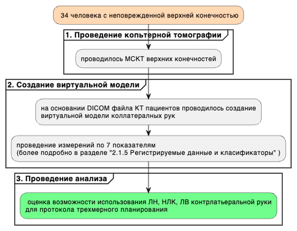
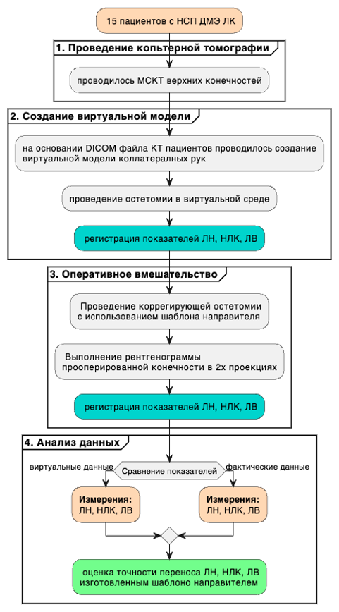

```{r setup, include=FALSE}
knitr::opts_chunk$set(echo = TRUE)
```

САНКТ-ПЕТЕРБУРГСКИЙ ГОСУДАРСТВЕННЫЙ УНИВЕРСИТЕТ

Кафедра травматологии и ортопедии

ПРОТОКОЛ КЛИНИЧЕСКОГО ИССЛЕДОВАНИЯ

Тема диссертационной работы: «Применение метода трехмерного планирования с созданием индивидуального шаблона-направителя в хирургическом лечении посттравматических деформаций дистального метаэпифиза лучевой кости»

Специальность: 3.1.8 – травматология и ортопедия

Научный руководитель: д.м.н., профессор, Беленький И.Г.

Исследователь:

соискатель кафедры травматологии и ортопедии СПбГУ, Турбин К.О.

Cанкт-Петербург, 2024

# 1. Общая информация

Протокол клинического исследования «Применение метода трехмерного планирования с созданием индивидуального шаблона-направителя в хирургическом лечении посттравматических деформаций дистального метаэпифиза лучевой кости»

№\_\_\_\_\_\_\_\_\_\_\_\_\_\_\_\_\_\_\_\_\_\_\_\_\_

Федеральное государственное бюджетное образовательное учреждение высшего образования «Санкт-Петербургский государственный университет»

Россия, 199034, Санкт-Петербург, Университетская наб., д. 7–9

Клиника высоких медицинских технологий имени Н. И. Пирогова Санкт-Петербургского государственного университета, Травматологическое отделение №2

Россия, 199004, Санкт-Петербург, Кадетская линия д. 13–15

# 2. Обоснование исследования

## 2.1 Актуальность исследования

Перелом ДМЭ ЛК является одним из наиболее распространенных переломов среди костной патологии в целом [@jupiter1991fractures; @chung2001; @jerrhag2017]. Это ведущая причина посещения травматологических пунктов и неотложной помощи в мире, где на эту патологию приходится 17-20% всех диагностированных переломов [@court-brown2006; @wilcke2013]. Общая частота переломов ДМЭ ЛК варьируется в различных исследованиях по всему миру. В Скандинавии этот показатель составляет около 30 на 10 000 в год, и почти 40% переломов приходится на детей в возрасте до 18 лет [@wilcke2013]. До сих пор нет единого мнения о наилучшем способе лечения перелома ДМЭ ЛК [@belloti2007; @okamura2018] и хотя хирургические методы и импланты постоянно развиваются, осложнения этого перелома сохраняются. Неправильное сращение встречается достаточно часто, по различным данным до 33% случаев [@cole1966comminuted; @gaspar2017].

Что касается типа перелома в соответствии с классификацией АО, то в литературе указывается, что тип А является наиболее распространенным, а тип В - наименее распространенным [@koo2013; @brogren2007]. Однако Sander, A. L. и коллеги отмечают в своем исследовании 2018 года [@sander2018] равную долю переломов типа А и С. Учитывая, что процент тяжелых переломов увеличивался с интенсивностью травмы, разница отражает долю взрослых пациентов с высокоэнергитической травмой.

Интересно, что Dahlen H. C. и коллеги в 2004 году исследовали переломы дистального отдела лучевой кости со смещением, классифицированные стандартными рентгенограммами как внесуставные переломы типа А2 и А3 по классификации АО, до оперативного лечения с помощью компьютерной томографии.

Сравнительный анализ неожиданно выявил вовлечение суставной поверхности дистального отдела лучевой кости в 57% случаев [@dahlen2004]. Из этого можно следует положение об ошибках определения типа перелома.

НСП ДМЭ ЛК является наиболее частым осложнением этой травмы и, следовательно, относительно частым клиническим явлением. Заболеваемость НСП ДМЭ ЛК, по-видимому, выше, когда перелом лечится иммобилизацией гипсовой повязкой, по данным литературы частота осложнения находится примерно около 24% [@katt2020; @sharma2014]. В то время как частота НСП ДМЭ ЛК ниже при оперативном лечении переломов [@sharma2014]. С появлением передовых хирургических методов частота НСП ДМЭ ЛК, по подсчетам, снизилась до 11% [@katt2020]. Margaliot Z. и коллеги в 2005 году [@margaliot2005] провели мета-анализ результатов лечения наружной фиксации по сравнению с внутренней (пластинами и винтами) показал, что частота с применением внутренней НСП ДМЭ ЛК составляет около 4%.Не все НСП ДМЭ ЛК являются симптоматическими. Часто степень клинической тяжести не коррелирует с степенью костной деформацией. Однако при симптомах НСП ДМЭ ЛК может привести к значительной инвалидности. В недавнем долгосрочном последующем исследовании Ali и коллеги в 2018 году [@ali2018] пришли к выводу, что пациенты, перенесшие перелом дистального отдела лучевой кости в возрасте от 18 до 65 лет и у которых развился НСП ДМЭ ЛК, с большей вероятностью будут иметь неблагоприятные клинические исходы, включая ограничение активности и боль. По сравнению с пациентами без НСП ДМЭ ЛК. У пациентов с НСП ДМЭ ЛК показатели инвалидности руки, плеча и кисти были заметно хуже по сравнению с исходным уровнем в возрасте от 12 до 14 лет, разница, которая была клинически значимой. Несмотря на субъективное несоответствие, не было объективных различий в отношении силы хвата или конечного диапазона движения.

Осложнения после корригирующей остеотомии ДМЭ ЛК такие же, как и после оперативного лечения острых переломов ДМЭ ЛК. Одним из основных осложнений после корректирующей остеотомии является несращение. Prommersberger K.J. и коллеги в своем исследовании обнаружили 4 несращения из 400 остеотомий [@prommersberger2012].

Haghverdian J.C. и коллеги [@haghverdian2019] сообщили об осложнениях корректирующих остеотомий при внесуставном неправильном соединении переломов дистального отдела лучевой кости. Исследовательская группа состояла из 60 пациентов, которые проходили процедуру в течение 8 лет. Частота осложнений составила почти 50%. Были зарегистрированы инфекция, несращение, потеря сокращения, несостоятельность имплантата, повреждение нерва, повреждение сухожилия и сложный региональный болевой синдром, 20% из которых были связаны с сухожилиями. Раздражение сухожилия и разрыв сухожилия были видны как при дорсальном, так и при ладонном доступе. Частота осложнений была выше у пациентов, которым была проведена остеотомия дистракционного типа, по сравнению с теми, у кого остеотомия была связана с ладонным кортикальным слоем.

Rivlin M и коллегии [@rivlin2016] сообщили о 6 пациентах с разрывом разгибательной мышцы после остеотомии и фиксации ладонной пластины для неправильного соединения переломов дистального отдела лучевой кости. Среднее время до разрыва сухожилия составляло 10 недель после операции. Этиологические факторы разрывов включали образование дорсальной костной мозоли у 4 пациентов, выступание аппаратного обеспечения у одного и дорсальный остеофит у последнего пациента.

Неправильное сращение переломов дистального отдела лучевой кости остается наиболее распространенным осложнением нехирургического лечения переломов дистального отдела лучевой кости и представляет собой обычное клиническое явление. Хирургическая коррекция - сложная проблема с непредсказуемыми клиническими исходами. Профилактика неправильного сращения переломов дистального отдела лучевой кости - лучший способ действий. Ладонной пластиной с фиксированным углом наклона, технология костного трансплантата, а также 3D-моделирование и компьютерные руководства по остеотомии являются многообещающими новыми технологиями, которые, вероятно, окажут положительное влияние на результаты хирургического лечения этой неприятной клинической проблемы.

## 2.2 Степень разработанности проблемы

Переломы ДМЭ ЛК очень часто курируются консервативно с помощью техники закрытой ручной репозиции, в настоящее время хорошо известно, что такая тактика лечения связана с высокой частотой осложнений и частыми плохими результатами. Посттравматическая деформация является наиболее распространенным осложнением [@mathews2015]. Неправильное сращение ДМЭ ЛК обычно возникает после консервативного лечения. Примерно 25% переломов ДМЭ ЛК, пролеченных закрытыми способами, консолидируются с деформациями, которые превышают общие допустимые параметры [@miyake2011; @haase2012]. Однако и хирургическая фиксация переломов ДМЭ ЛК не лишена этой проблемы. Когда стала более распространенной хирургическая тактика, можно увидеть увеличение доли этого осложнения в когорте прооперированных пациентов. Независимо от используемого метода стабилизации, частота посттравматической деформации уменьшается только до 10% [@prommersberger2012; @schweizer2013]. В результате почти 80% деформации ДМЭ ЛК формируются после неудачной закрытой репозиции, а остальные 20% являются следствием остеосинтеза. Как правило большая часть из этого числа — это процедуры, где выполняется минимально инвазивные методы, такие как черезкожные спицы Киршнера [@mckay2001; @delclaux2016].

Большинство авторов подчеркивают важность 3D-планируемых корректирующих остеотомий с учетом того факта, что 3D-деформации часто не устраняются с помощью обычных методов 2D-планирования. Vroemen J. C.и его коллеги показали, что клинический исход коррелирует с 3D-дефицитом вращения, но не с 2D-параметрами оценки [@vroemen2013].

Впоследствии следует отметить, что в большинстве исследований в этом обзоре использовались традиционные рентгенограммы для оценки послеоперационного положения лучевой кости вместо метода визуализации, который облегчает 3D-оценку.

Остаточные деформации могли быть недооценены.

К недостаткам метода 3D-планирования относятся необходимость в специализированном программном обеспечении, время и усилия, необходимые для предоперационного планирования, облучение и затраты на изготовление шаблона на заказ и компьютерную томографию [@mulders2017]. Чтобы полностью понять дополнительную ценность 3D-планирования корректирующих остеотомий, мы считаем, что рандомизированное контролируемое исследование неизбежно.

Благодаря современным достижениям в области технологии 3D-печати большинство методов, рассмотренных в этом исследовании, становятся коммерчески доступными. Несколько компаний (например, Xilloc BV, Маастрихт, Нидерланды или Materialise NV, Левен, Бельгия) предоставляют услуги по разработке руководств по разрезанию для конкретного пациента на основе данных CAT и данных лечащего хирурга. Полный процесс виртуального планирования и производства имплантатов для конкретного пациента занимает 6-8 недель в зависимости от сложности случая. Индивидуальные направляющие для резки и сверления, соответствующие геометрии костей пациентов, могут сделать менее доступные технологии, такие как оптические устройства слежения, устаревшими. Учитывая важность точности, весьма вероятно, что будущие остеотомии будут идти рука об руку с методами 3D-планирования.

3D-планируемые корректирующие остеотомии показывают значительное улучшение как функциональных, так и рентгенологических результатов у пациентов с неправильным сращением дистального отдела лучевой кости. С учетом современных достижений в области технологии 3D-печати это представляется многообещающим методом лечения сложных аномалий дистального отдела лучевой кости.

Однако необходимы дальнейшие исследования, чтобы сделать определенный вывод о клинической ценности методов 3D-планирования для посттравматической деформации ДМЭ ЛК с уточнением категории пациентов, также требуется описание протокола создания шаблона-направителя, оценка использования коллатеральной стороны для использования параметров лучевого наклона, ладонного наклона и лучелоктевого индекса.

# 3. Цель исследования

Улучшить результаты хирургического лечения посттравматической деформации дистального метаэпифиза лучевой кости

# 4. Задачи исследования

1.  Ретроспективно оценить среднесрочные клинические результаты хирургического лечения посттравматической деформации дистального метаэпифиза лучевой кости

2.  Сравнить по данным компьютерной томографии здоровых людей анатомическое соответствие контралатеральных сторон дистального метаэпифиза лучевой кости.

3.  Разработать метод, который на основе данных компьютерной томографии позволяет оценить трехмерную конфигурацию посттравматической деформации, задать плоскость планируемой остеотомии, а также создать шаблон-направитель, позволяющий провести запланированную остеотомию на реальной операции.

4.  Оценить возможность применения метода трехмерного планирования с созданием индивидуального шаблона-направителя в хирургическом лечении посттравматической деформации дистального метаэпифиза лучевой кости.

5.  Оценить влияние на ближайшие анатомические и среднесрочные анатомические, функциональные результаты применения метода трехмерного планирования с созданием индивидуального шаблона-направителя в хирургическом лечении посттравматической деформации дистального метаэпифиза лучевой кости

# 5. Дизайн диссертационного исследования

## 5.1 Общая структура исследования

Моноцентровое комбинированное (ретроспективно-проспективное) продленное сравнительное контролируемое исследование, которое будет проводиться в соответствии с протоколом GСР и требованиями действующих нормативных документов.

Настоящее исследование будет разделено на три этапа: первый этап (ретроспективное исследование), второй этап, состоящий из двух частей (экспериментальный этап) и третий этап (проспективное клиническое исследование).

Определённые этапы имеют логическую последовательность, которая обеспечит выполнение всех поставленных задач.


Рисунок №1. Общая схема диссертационного исследования

## 5.2 Первый этап исследования ретроспективный

На первом этапе планируется исследование 46 пациентов. Эту часть исследования можно охарактеризовать как ретроспективное кагортное исследование Будет сформирована 1 общая группа R (R- от английского retrospective - ретроспективный). Регистрировались и оценивались такие показатели анамнеза, инструментальные данные и данные анкетирования.

Критериями включения для этапов исследования, где исследемыми были данные с НСП ДМЭ ЛК заболевание которое прявлялось болью в запястье, деформацией и ограничением объема движений. Диагноз посттравматической деформации НСП ДМЭ ЛК должен быть установлен на основании полного сбора анамнеза и данных рентгенологического исследования лучезапястного сустава в прямой и боковой проекциях. Все пациенты должны были перенсти внесуставной перелом, первоначально была выполнена закрытая ручная репозиция отломков с последующей гипсовой иммобилизацией в среднем на 6-8 недель, затем при неудовлетворительном результате была проведена корегирующая остетомия ДМЭ ЛК.


Рисунок №2. Схема первого ретроспективного этапа исследования

**Цель и планируемые раезультаты этапа**

Целью настоящего этапа исследования будет ретроспективно оценить среднесрочные клинические результаты хирургического лечения посттравматической деформации дистального метаэпифиза лучевой кости.

Предполагаемыми результатами этапа исследования будет определения разницы в функциональных результатх у пацентов с повышенным требованием к функции руки.

Выполнение этого исследования позволит решить первую задачу настоящего исследования.

**Критерии включения и исключения**

Критериями включения для этапа исследования, была документация пацеинотов где проводилась проведена корегирующая остетомия ДМЭ ЛК по поводу НСП ДМЭ ЛК в следствии внесуставного перелома ЛК.

Критериями исключения были:

• сахарный диабет в намнезе

• носительство вируса гепатита В или С, вируса иммонодефецита человека

• специфический артрит

• хроническая почечная недостаточность (креатинин \>200 мкмоль/л)

• хроническое применение глюкокортикойдов

• иммунодепрессантов, иммуномодулирующих препаратов, опиойдов.

**Описание контрольных точек исследования**

Данные, собранные из медицинской документации, пациентов пролеченных в КМВТ СПбГУ.

Контролная точка зависит от давности выполнения операции. Предположительно от 1 до 5 лет. В этой точке будет проводиться анкетирование пациентов очно или дистанционно. Очно будет проводиться осмотр и оценка объема движений.

**Регистрируемые данные**

По выявленным показателям проводилась оценка качества коррегирующей остеотомии ДМЭ ЛК при неправильом сращениии ДМЭ ЛК. Среди регистрируемых данных планируется:

1)  пол

• мужской

• женский,

2)  время от момнта травмы до операции

имерение в годах

3)  возраст

имерение в годах

4)  ИМТ

измерени в м3/кг

5)  поврежденная сторона

• левая

• правая

6)  доминирующая рука

• левая

• правая

7)  повреждение домонирующей руки

• да

• нет

8)  тип теформации

• ладонная

• дорсальная

9)  тип труда (смшенный/ручной),

• смшенный - профессии уственного труда, а так же професии не имеющие особых требований к функции кисти

• ручной - профессии ручного труда, а так же професии имеющие особые требования к функции кисти

10) наклон лучевой кости (НЛК) — это наклон дистальной поверхности лучевой кости по отношению к ее оси. НЛК определяется в прямой проекции как угол между линией, проведенной между точкой шиловидного отростка лучевой кости и самой медиальной точки суставной поверхности локтевой кости [@pope2014musculoskeletal]. НЛК менее 15° — это относительное показание к оперативному лечению перелома или деформации ДМЭ ЛК [@kehr2010david]. В норме этот показатель 21-25° (в среднем 22-24°) [@harisinghani2018primer; @guglielmi2001fundamentals]. При угле более 25° следует говорить о деформации Маделунга [@hanson2018]. НЛК является важным измерением при оценке переломов дистального отдела лучевой кости и деформаций лучевой кости. Регистрация абсолютного показателя и его интерпретация (меньше/норма/больше) для поврежденной руки и здоровой руки до операции, после опреации и на кортольной точке оценки, срок зависит от давности выполнения операции. Предположительно от 1 до 5 лет.

11) ладонный наклон (ЛН) будет оценивается на боковой рентгенограмме лучезапястного сустава, он соответствует углу, образованному линией, проведенной перпендикулярно оси лучевой кости, и линией, которая проходит через кончики тыльного и лучевого краев, т.е. вдоль суставной поверхности лучевой кости) [@wolfe2021green; @graftiaux2015charles]. В норме этот показатель находится в диапазоне 7-15º [@perugia2014; @mignemi2013], в среднем 11º [@wolfe2021green; @graftiaux2015charles], хотя некоторые авторы считают нормальным диапазон 2-20º [@marincek2007emergency; @harisinghani2018primer]. Регистрация абсолютного показателя и его интерпретация (меньше/норма/больше) для поврежденной руки и здоровой руки до операции, после опреации и на кортольной точке оценки, срок зависит от давности выполнения операции. Предположительно от 1 до 5 лет.

12) Лучевая высота (ЛВ) — это расстояние между двумя линиями, проведенными перпендикулярно длинной оси лучевой кости в прямой проекции от вершины шиловидного отростка лучевой кости и уровня суставной поверхности локтевой кости. Нормальная ЛВ находится в диапазоне 8-14 мм, значения варьируются от публикации к публикации [@lalone2015; @perugia2014]. Потеря ЛВ является показателем потери функции лучезапястного сустава. Исправление укорочение лучевой кости является целью при хирургической тактике [@watson2016]. Регистрация абсолютного показателя и его интерпретация (меньше/норма/больше) для поврежденной руки и здоровой руки до операции, после опреации и на кортольной точке оценки, срок зависит от давности выполнения операции. Предположительно от 1 до 5 лет.

13) Оценка анкетирование DASH в баллах на контрольной точке доступных к опросу пациентов, срок зависит от давности выполнения операции. Предположительно от 1 до 5 лет.

14) Оценка анкетирование SF-16 (физический и ментальный компонент) в баллах на контрольной точке доступных к опросу пациентов, срок зависит от давности выполнения операции. Предположительно от 1 до 5 лет.

15) Оценка анкетирование объема сгибани-разгибания в запястье на контрольной точке доступных к опросу пациентов, срок зависит от давности выполнения операции. Предположительно от 1 до 5 лет.

Измерение тыльного и ладонного сгибания проводилось с использование угломера ножки угломера были расположены по ходу оси предплечья и II пястной кости [@reese2016joint]. Тыльное сгибание считалось максимальными до 50 градусов, а ладонное до 70 градусов. Объем движений оценивался как сумма тыльного и ладонного сгибания и максимальное значение было до 120 градусов.

15) Оценка анкетирование объема пронации-супинации в запястье на контрольной точке доступных к опросу пациентов, срок зависит от давности выполнения операции. Предположительно от 1 до 5 лет.

Измерение пронации и супинации отведения проводилось с использование угломера Плечи исследуемого были прижаты к туловищу, преплечья находились на горизонтальной поверхности Угол сгибания в локтевом суставе составлял 90 градусов. В руке пациент держал карандаш, который был перемещаемой осью Изначальная позиция карандаша была 90 градусов относительно горизонтальной поверхности Далее пациент выполнял последовательно супинацию и пронацию. Супинация считалась максимальной до 90 градусов, а пронация до 50 градусов [@valone2019]. Объем движений оценивался как сумма пронации и супинации и максимальное значение было до 140 градусов.

16) Оценка анкетирование объема аддкуции-абдукции в запястье на контрольной точке доступных к опросу пациентов, срок зависит от давности выполнения операции. Предположительно от 1 до 5 лет.

Измерение лучевого и локтевого отведения также проводилось с использование угломера ножки угломера были расположены по ходу оси предплечья и II пястной кости [@reese2016joint]. Лучевое отведение считалось максимальными до 30 градусов, а локтевое до 30 градусов. Объем движений оценивался как сумма лучевого и локтевого отведения и максимальное значение было до 60 градусов.

17) Измерение силы захвата кисти проводилось с помощью динамометра. Плечи исследуемого были прижаты к туловищу, преплечья находились на горизонтальной поверхности Врач вкладывал в руку пациенту динамометр Далее пациент выполнял последовательно в левой кисти 3 максимальных сжатия, затем в правой. Показатель неповрежденной руки считался максимальным у данного пациента. Бедет регистрироваться относительное значение по формуле (Показатель поврежденной руки(кг)/Показатель неповрежденной руки (кг))/100(%).

**Необходимое оборудовние и инструменты**

В исследовании требуется использование Динамометр электронный ДМЭР 120 и Угломер медицинский ЦИТО, универсальный.

Анкета DASH, SF-16 (физический и ментальный компонент)

## 5.3 Описание второго этапа исследования (экспериментальный)

Вторая часть настоящего исследования заключается в решении 3 задач настоящего диссертационного исследования, а именно

Задача № 2. Сравнить по данным компьютерной томографии здоровых людей анатомическое соответствие контралатеральных сторон дистального метаэпифиза лучевой кости.

Задача № 3. Разработать метод, который на основе данных компьютерной томографии позволяет оценить трехмерную конфигурацию посттравматической деформации, задать плоскость планируемой остеотомии, а также создать шаблон-направитель, позволяющий провести запланированную остеотомию на реальной операции.

Задача № 4. Оценить возможность применения метода трехмерного планирования с созданием индивидуального шаблона-направителя в хирургическом лечении посттравматической деформации дистального метаэпифиза лучевой кости.

Для этого поланируется разделить этот этап на 2 части.

### 5.3.1 Первая часть второго этапа исследования

В первой части второго тапа предположительно будет исследовано 34 человека с неповрежденной врхней конечностью. Будет сформирована группа M (M- от английского measurement - измерение). Участникам исследования проводиласть мультиспиральная компьютерная томография обеих лучезапястных суставов (МСКТ). Регистрировались и оценивались инструментальные данные. Далее проводилось сравнение противоположных конечностей с целью решения вопросв Можно ли использовать показатели противоположной руки для моделирования коррегирующей остеотомии?



Рисунок №3. Схема первой части второго этапа исследования

**Цель и планируемые раезультаты этапа**

Целью настоящего этапа исследования будет сравннение по данным компьютерной томографии здоровых людей анатомическое соответствие контралатеральных сторон дистального метаэпифиза лучевой кости.

Предполагаемыми результатами этапа исследования будет определение отсутвия разницы в референтных значений коллатеральных рук, что позволит говорить о применении измерений коллатеральной руки для протокола трехмерого плагнирования коррегирующей остеотомии лучевой кости с создание шаблона направителя.

Выполнение этого исследования позволит решить вторую задачу настоящего исследования.

**Критерии включения и исключения**

Людт без повреждения верхней конечности, подписавшие согласие на настоящее исследование.

**Описание контрольных точек исследования**

Одна контрольная точка, где проводиться МСКТ 2 верхних конечностей с дальнейшей оценкой рентгенологических показалетй.

**Регистрируемые данные**

1)  возраст - измеряется в годах

2)  пол

• мужской

• женский,

3)  тип труда (смшенный/ручной),

• смшенный - профессии уственного труда, а так же професии не имеющие особых требований к функции кисти

• ручной - профессии ручного труда, а так же професии имеющие особые требования к функции кисти

4)  наклон лучевой кости (НЛК) — это наклон дистальной поверхности лучевой кости по отношению к ее оси. НЛК определяется в прямой проекции как угол между линией, проведенной между точкой шиловидного отростка лучевой кости и самой медиальной точки суставной поверхности локтевой кости [@pope2014musculoskeletal]. НЛК менее 15° — это относительное показание к оперативному лечению перелома или деформации ДМЭ ЛК [@kehr2010david]. В норме этот показатель 21-25° (в среднем 22-24°) [@harisinghani2018primer; @guglielmi2001fundamentals]. При угле более 25° следует говорить о деформации Маделунга [@hanson2018]. НЛК является важным измерением при оценке переломов дистального отдела лучевой кости и деформаций лучевой кости.

5)  ладонный наклон (ЛН) будет оценивается на боковой рентгенограмме лучезапястного сустава, он соответствует углу, образованному линией, проведенной перпендикулярно оси лучевой кости, и линией, которая проходит через кончики тыльного и лучевого краев, т.е. вдоль суставной поверхности лучевой кости) [@wolfe2021green; @graftiaux2015charles]. В норме этот показатель находится в диапазоне 7-15º [@perugia2014; @mignemi2013], в среднем 11º [@wolfe2021green; @graftiaux2015charles], хотя некоторые авторы считают нормальным диапазон 2-20º [@marincek2007emergency; @harisinghani2018primer].

6)  Лучевая высота (ЛВ) — это расстояние между двумя линиями, проведенными перпендикулярно длинной оси лучевой кости в прямой проекции от вершины шиловидного отростка лучевой кости и уровня суставной поверхности локтевой кости. Нормальная ЛВ находится в диапазоне 8-14 мм, значения варьируются от публикации к публикации [@lalone2015; @perugia2014]. Потеря ЛВ является показателем потери функции лучезапястного сустава. Исправление укорочение лучевой кости является целью при хирургической тактике [@watson2016].

7)  Измерение угла ладонной поверхности ЛК будет также включено, так как это вазно с точки зрения позиционирования пластины. В этом исследовании будет проводится с использованием 2D-срезов КТ в сагиттальной (yz) плоскости, расположенных в 3 положениях:

• Медиальный угол ладонной поверхности ЛК - через латеральный край полулунной ямки,

• Медианный угол ладонной поверхности ЛК - через медиальный край ладьевидной ямка

• Латеральный угол ладонной поверхности ЛК - через центр центр ладьевидной ямки

• Среднее сзначение углов ладонной поверхности - будет расчитываться как среднее от медиальный, медианный и латеральный углы ладонной поверхности

**Необходимое оборудовние и инструменты**

Тредуется выполнение МСКТ (мультиспиральная компьютерная томография). Планируется использование компьютерного томографа Toshiba Aquilion 64 с дистанцией между срезами 0,5 мм. Во избежание накопления ошибок, связанных с погрешностью передачи данных рекомендовано использовать слой не более 1 мм, но лучше 0,5 мм. Полученные данные сохраняются в формате DICOM.

Програмное обеспечение для сегментирования и моделирования. Планируется использование программного обеспечения Materialise Mimics.

### 5.3.2 Вторая часть второго этапа исследования

Во второй части второго тапа предположительно будет исследовано 44 пациентов. Будет сформирована группа O (O- от английского opening - открытие, дебют). Будет проведена разработка протокола пердоперационного планирования с созданием шаблона направителя. Пациентам на этом этапе будет предлагаться пройти по протоколу лечения с использованием шаблона направителя. При получении согласия пациентам будет проводиться МСКТ обеих верхних конечностей и перед госпитализацией проводиться трехмерное планирование коррегирующей остеомии лучевой кости с созданием индивидуального шаблона-направителя. Будут регистрироваться и оцениваьбся инструментальные данные. Далее будет проводится сравненеи данных полученных в результате планинирования в виртуальной среде с данным рентгенографии сразу после опеарции.



Рисунок №4. Схема второй части второго этапа исследования

**Цель и планируемые раезультаты этапа**

Оценить возможность применения метода трехмерного планирования с созданием индивидуального шаблона-направителя в хирургическом лечении посттравматической деформации дистального метаэпифиза лучевой кости.

Предполагаемыми результатами этапа исследования будет разработка метода, который на основе данных компьютерной томографии позволит оценить трехмерную конфигурацию посттравматической деформации, задать плоскость планируемой остеотомии, а также создать шаблон-направитель, позволяющий провести запланированную остеотомию на реальной операции и при выполнении операций с шаблоном-направителем определение отсутвия разницы в референтных значений данных полученных в результате планинирования в виртуальной среде с данным рентгенографии сразу после опеарции.

Выполнение этого исследования позволит решить третью и четвертую задачу настоящего исследования.

**Критерии включения и исключения**

Пациенты с неправильным сращением ДМЭ ЛК по поводу НСП ДМЭ ЛК в следствии внесуставного перелома ЛК.

Критериями исключения были:

• сахарный диабет в намнезе

• носительство вируса гепатита В или С, вируса иммонодефецита человека

• специфический артрит

• хроническая почечная недостаточность (креатинин \>200 мкмоль/л)

• хроническое применение глюкокортикойдов

• иммунодепрессантов, иммуномодулирующих препаратов, опиойдов.

**Описание контрольных точек исследования**

Первая контрольная точка, где проводиться МСКТ 2 верхних конечностей с дальнейшей оценкой рентгенологических показалетй и планированием остетомии в вертуальной среде.

Вторая контрольная точка - это оценка рентгенологических снимков сразу после операции.

**Регистрируемые данные**

1)  месяц от травмы - измеряется в месяцах

2)  пол

• мужской

• женский,

3)  возраст - измеряется в годах

4)  поврежденная сторона

• левая

• правая

5)  доминирующая рука

• левая

• правая

6)  повреждение домонирующей руки

• да

• нет

7)  тип теформации

• ладонная

• дорсальная

8)  тип труда (смшенный/ручной),

• смшенный - профессии уственного труда, а так же професии не имеющие особых требований к функции кисти

• ручной - профессии ручного труда, а так же професии имеющие особые требования к функции кисти

9)  наклон лучевой кости (НЛК) — это наклон дистальной поверхности лучевой кости по отношению к ее оси. НЛК определяется в прямой проекции как угол между линией, проведенной между точкой шиловидного отростка лучевой кости и самой медиальной точки суставной поверхности локтевой кости [@pope2014musculoskeletal]. НЛК менее 15° — это относительное показание к оперативному лечению перелома или деформации ДМЭ ЛК [@kehr2010david]. В норме этот показатель 21-25° (в среднем 22-24°) [@harisinghani2018primer; @guglielmi2001fundamentals]. При угле более 25° следует говорить о деформации Маделунга [@hanson2018]. НЛК является важным измерением при оценке переломов дистального отдела лучевой кости и деформаций лучевой кости.

10) ладонный наклон (ЛН) будет оценивается на боковой рентгенограмме лучезапястного сустава, он соответствует углу, образованному линией, проведенной перпендикулярно оси лучевой кости, и линией, которая проходит через кончики тыльного и лучевого краев, т.е. вдоль суставной поверхности лучевой кости) [@wolfe2021green; @graftiaux2015charles]. В норме этот показатель находится в диапазоне 7-15º [@perugia2014; @mignemi2013], в среднем 11º [@wolfe2021green; @graftiaux2015charles], хотя некоторые авторы считают нормальным диапазон 2-20º [@marincek2007emergency; @harisinghani2018primer].

11) Лучевая высота (ЛВ) — это расстояние между двумя линиями, проведенными перпендикулярно длинной оси лучевой кости в прямой проекции от вершины шиловидного отростка лучевой кости и уровня суставной поверхности локтевой кости. Нормальная ЛВ находится в диапазоне 8-14 мм, значения варьируются от публикации к публикации [@lalone2015; @perugia2014]. Потеря ЛВ является показателем потери функции лучезапястного сустава. Исправление укорочение лучевой кости является целью при хирургической тактике [@watson2016].

**Необходимое оборудовние и инструменты**

Тредуется выполнение МСКТ (мультиспиральная компьютерная томография). Планируется использование компьютерного томографа Toshiba Aquilion 64 с дистанцией между срезами 0,5 мм. Во избежание накопления ошибок, связанных с погрешностью передачи данных рекомендовано использовать слой не более 1 мм, но лучше 0,5 мм. Полученные данные сохраняются в формате DICOM.

Програмное обеспечение для сегментирования и моделирования. Планируется использование программного обеспечения Materialise Mimics.

Пластик Harz Labs, материал dental yellow clear. Жидкая фотополимерная смола стоматологического применения, для изготовления хирургических шаблонов при установке имплантатов.

3d принтер photon mono x6.

Стандартный набор для проведения корригирующей остетомии ДМЭ ЛК.

## 5.4 Описание третьего этапа исследования проспективное клиническое исследование

На третьем этапе предположительно будет исследовано 48 пациентов. Пациенты были разделены на 2 группы: A и Б - принцип названия взят как порядковые буквы алфавита. Группа A булет контрольной и в нее войдут 26 пациенов. В этой группе протокол лечения был по традиционной методике. Во группу Б предположительно войдут 22 пациента. Это группа будет исследуемой. Пациенты этой группы будут проходить лечение с применением разработанного протокола трехмерного планирования с применением шаблона направителя. Это этап стал завершающим настоящее диссертационное исслеование.


Рисунок №5. Схема третьего этапа исследования

**Цель и планируемые раезультаты этапа**

Оценить влияние на ближайшие анатомические и среднесрочные анатомические, функциональные результаты применения метода трехмерного планирования с созданием индивидуального шаблона-направителя в хирургическом лечении посттравматической деформации дистального метаэпифиза лучевой кости.

Предполагаемыми результатами этапа исследования будет улучшение результатов хирургического лечения посттравматической деформации дистального метаэпифиза лучевой кости.

Выполнение этого исследования позволит решить пятую задачу и достижение цели настоящего исследования.

**Критерии включения и исключения**

Пациенты с неправильным сращением ДМЭ ЛК по поводу НСП ДМЭ ЛК в следствии внесуставного перелома ЛК.

Критериями исключения были:

• сахарный диабет в намнезе

• носительство вируса гепатита В или С, вируса иммонодефецита человека

• специфический артрит

• хроническая почечная недостаточность (креатинин \>200 мкмоль/л)

• хроническое применение глюкокортикойдов

• иммунодепрессантов, иммуномодулирующих препаратов, опиойдов.

**Описание контрольных точек исследования**

Первая контрольная точка, где проводиться МСКТ 2 верхних конечностей с дальнейшей оценкой рентгенологических показалетй и планированием остетомии в вертуальной среде.

Вторая контрольная точка - это оценка рентгенологических снимков сразу после операции.

**Регистрируемые данные**

1)  месяц от травмы - измеряется в месяцах

2)  пол

• мужской

• женский,

3)  возраст - измеряется в годах

4)  поврежденная сторона

• левая

• правая

5)  доминирующая рука

• левая

• правая

6)  повреждение домонирующей руки

• да

• нет

7)  тип теформации

• ладонная

• дорсальная

8)  тип труда (смшенный/ручной),

• смшенный - профессии уственного труда, а так же професии не имеющие особых требований к функции кисти

• ручной - профессии ручного труда, а так же професии имеющие особые требования к функции кисти

9)  наклон лучевой кости (НЛК) до операции, сразу после операции и на контрольной точке 12 месяцев — это наклон дистальной поверхности лучевой кости по отношению к ее оси. НЛК определяется в прямой проекции как угол между линией, проведенной между точкой шиловидного отростка лучевой кости и самой медиальной точки суставной поверхности локтевой кости [@pope2014musculoskeletal]. НЛК менее 15° — это относительное показание к оперативному лечению перелома или деформации ДМЭ ЛК [@kehr2010david]. В норме этот показатель 21-25° (в среднем 22-24°) [@harisinghani2018primer; @guglielmi2001fundamentals]. При угле более 25° следует говорить о деформации Маделунга [@hanson2018]. НЛК является важным измерением при оценке переломов дистального отдела лучевой кости и деформаций лучевой кости.

10) ладонный наклон (ЛН) до операции, сразу после операции и на контрольной точке 12 месяцев будет оценивается на боковой рентгенограмме лучезапястного сустава, он соответствует углу, образованному линией, проведенной перпендикулярно оси лучевой кости, и линией, которая проходит через кончики тыльного и лучевого краев, т.е. вдоль суставной поверхности лучевой кости) [@wolfe2021green; @graftiaux2015charles]. В норме этот показатель находится в диапазоне 7-15º [@perugia2014; @mignemi2013], в среднем 11º [@wolfe2021green; @graftiaux2015charles], хотя некоторые авторы считают нормальным диапазон 2-20º [@marincek2007emergency; @harisinghani2018primer].

11) Лучевая высота (ЛВ) до операции, сразу после операции и на контрольной точке 12 месяцев — это расстояние между двумя линиями, проведенными перпендикулярно длинной оси лучевой кости в прямой проекции от вершины шиловидного отростка лучевой кости и уровня суставной поверхности локтевой кости. Нормальная ЛВ находится в диапазоне 8-14 мм, значения варьируются от публикации к публикации [@lalone2015; @perugia2014]. Потеря ЛВ является показателем потери функции лучезапястного сустава. Исправление укорочение лучевой кости является целью при хирургической тактике [@watson2016].

12) Время операции в минутах

13) Количество снимков ЭОП в штуках

14) Сумарное время экспозиции снимков всекундах

15) Сумарная доза в мЗВ

16) Оценка анкетирование DASH в баллах до операции и на контрольной точке доступных к опросу пациентов на 12 месяц.

17) Оценка анкетирование SF-16 (физический и ментальный компонент) в баллах до операции и на контрольной точке доступных к опросу пациентов на 12 месяц.

18) Оценка анкетирование объема сгибани-разгибания в запястье на контрольной точке доступных к опросу пациентов на 12 месяц.

Измерение тыльного и ладонного сгибания проводилось с использование угломера ножки угломера были расположены по ходу оси предплечья и II пястной кости [@reese2016joint]. Тыльное сгибание считалось максимальными до 50 градусов, а ладонное до 70 градусов. Объем движений оценивался как сумма тыльного и ладонного сгибания и максимальное значение было до 120 градусов.

19) Оценка анкетирование объема пронации-супинации в запястье на контрольной точке доступных к опросу пациентов на 12 месяц.

Измерение пронации и супинации отведения проводилось с использование угломера Плечи исследуемого были прижаты к туловищу, преплечья находились на горизонтальной поверхности Угол сгибания в локтевом суставе составлял 90 градусов. В руке пациент держал карандаш, который был перемещаемой осью Изначальная позиция карандаша была 90 градусов относительно горизонтальной поверхности Далее пациент выполнял последовательно супинацию и пронацию. Супинация считалась максимальной до 90 градусов, а пронация до 50 градусов [@valone2019]. Объем движений оценивался как сумма пронации и супинации и максимальное значение было до 140 градусов.

20) Оценка анкетирование объема аддкуции-абдукции в запястье на контрольной точке доступных к опросу пациентов на 12 месяц.

Измерение лучевого и локтевого отведения также проводилось с использование угломера ножки угломера были расположены по ходу оси предплечья и II пястной кости [@reese2016joint]. Лучевое отведение считалось максимальными до 30 градусов, а локтевое до 30 градусов. Объем движений оценивался как сумма лучевого и локтевого отведения и максимальное значение было до 60 градусов.

21) Измерение силы захвата кисти проводилось с помощью динамометра. Плечи исследуемого были прижаты к туловищу, преплечья находились на горизонтальной поверхности Врач вкладывал в руку пациенту динамометр Далее пациент выполнял последовательно в левой кисти 3 максимальных сжатия, затем в правой. Показатель неповрежденной руки считался максимальным у данного пациента. Бедет регистрироваться относительное значение по формуле (Показатель поврежденной руки(кг)/Показатель неповрежденной руки (кг))/100(%).

**Необходимое оборудовние и инструменты**

В исследовании требуется использование Динамометр электронный ДМЭР 120 и Угломер медицинский ЦИТО, универсальный.

Анкета DASH, SF-16 (физический и ментальный компонент)

Тредуется выполнение МСКТ (мультиспиральная компьютерная томография). Планируется использование компьютерного томографа Toshiba Aquilion 64 с дистанцией между срезами 0,5 мм. Во избежание накопления ошибок, связанных с погрешностью передачи данных рекомендовано использовать слой не более 1 мм, но лучше 0,5 мм. Полученные данные сохраняются в формате DICOM.

Програмное обеспечение для сегментирования и моделирования. Планируется использование программного обеспечения Materialise Mimics.

Пластик Harz Labs, материал dental yellow clear. Жидкая фотополимерная смола стоматологического применения, для изготовления хирургических шаблонов при установке имплантатов.

3d принтер photon mono x6.

Стандартный набор для проведения корригирующей остетомии ДМЭ ЛК.

# 6. Лечение

Пациентам будет проводится хирургическое лечение, заключающеся в коррегирующей остоетомии ДМЭ ЛК.

Хирургические вмешательства будут выполнены одним и тем же хирургом. Будет использоваться модифицированный передний доступ, описанный Генри [@dashe2020]. Мышца квадратного пронатора будет пересекаться, чтобы обнажить дистальную часть лучевой кости с исходной костной мозолью перелома. В группе B шаблон направитель для остеотомии будет устанавливался с закреплением спицами Киршнера. Для подтверждения положения направителя для остеотомии будет использоваться интраоперационная рентгеноскопия. Лучевая остеотомия будет выполняться с использованием этого же направителя с помощью осциллирующей пилы. Затем шаблон-направитель будет удален. В группе А и R шаблон-направитель не будет использоваться. Фиксация будет производиться с помощью анатомической фиксирующей ладонной пластины - Biomet-Zimmer DVR Crosslock Distal Radius Plate. Дефект кости заполняться не будет, а сращение отломко будет обеспечено сопоставлением кортикалов. Сначала будут установлены эпифизарные винты в направляющих отверстиях пластины и затем метафизарные винты. Для подтверждения коррекции неправильного сращения будет использоваться рентгеноскопия с определением физиологического восстановления анатомии дистального отдела лучевой кости и верного позиционирования фиксирующего материала. При наличиии техническая возможности, будет производиться фиксация квадратного пронатора. Будет производилось ушивание раны без установка дренажа не производилась. Время операции фиксировалось.

*Послеоперационное лечение*

Гипсовая повязка будет устанавливаться непосредственно в операционной по ладонной поверхности. Пртоколы реабилитации будут применяться с певых дней. Снятие швов проводилось на 12–14 дней после операции. Некоторым пациентам проводилась установка термопластической шины на предплечье на 6 неделю. Рентгенологический контроль на 8 недель после операции с целью установки факта консолидации и перехода к следующему протоколу реабилитации. Традиционный радиологический контроль будет через 3 месяца после операции. Если требуемая консолидация будет достигнута, то пациенту будет разрена максимальная нагрузка. Клинико-рентгенологический контроль с помощью традиционной рентгенографии будет на 12 месяц после операции. Оценка функции кисти также а 12 месяц после операции. Плнируемое среднее время восстановления от 8 до 12 недель. Нетрудоспособность для профессий смешанного труда примерно от 2 до 4 недель, для профессий ручного труда не менее 12 недель [@labèr2023].

Всем пациентам будет предлагаться протокол реабилитационного лечения. Протокол будет состоять из 2х отдельных протоколов: протокол для пальцев (первые 6 недель), протокол для запястья (6-10 недель). Первый протокол будет направлен на разработку движений в пальцах На день 1–7 будет применяться изолированное пассивное и активное движение большого пальца, а также упражнения для противопоставления большого пальца 2–4 неделя сгибание проксимальных межфаланговых суставов 2-5 пальцев с доведением сгибания до 80 градусов. Неделя 4–8 проведение сгибательных движений с сопротивлением. Далее будет использоваться протокол разработки движений в запястье. Первая фаза (6-8 недель) протокола запястья преполагала мягкое пассивное сгибание, разгибание, пронация/супинация запяться и активная работа пальцами. Следуюшая фаза (8-10 недель) предпоалгала мягкое активное сгибание, разгибание, пронация/супинация запяться. Последняя фаза (более 10 недель) будет предполагать прогрессивные укрепляющие упражнения [@slutsky2005].

# 7. Оценка безопасности

К критериям эффективности проводимого лечения будут отнесены уровень болевого синдрома, влияние болевого синдрома на качество жизни и повседневную активность пациента, восстановление функции лучезапястного сустава и кисти, выражающееся в объёме активных и пассивных движений, переносимости функциональной нагрузки, возвращении к желаемому уровню физической активности.

# 8. Методы сбора и обработки данных

Сбор данных настоящего диссретационного исследования будет производиться с помощью электронных такблиц ecxel.

Статистические методы оценки при расчете данных лпанируется использование программы Statistica v.12 c применением встроенных пакетов расчетов по критериям. Для определения нормальности распределения выборки планируется применение критерии Колмогорова и Shapiro-Wilk. Для определения непрерывных величин использование критерия Манна-Уитни для независимых непараметрических выборок и t-критерия Стюдента для независимых параметрических выборок. Для определения независимых качественных величин Хи-квадрат Пирсона, при недостаточном количестве наблюдений точный критерий Фишера.

# 9. Прямой доступ к первичным данным документации

Доступ к первичным данным исследования обеспечивается исследователю, а также Этическому комитету и уполномоченным регулирующим и надзорным органам в соответствии с действующими Руководящими документами и Законодательством РФ.

# 10. Контроль качества и обеспечение качества

Все связанные с исследованием мероприятия выполняются на зарегистрированном и разрешённом к применению на территории Российской Федерации установленным порядком оборудовании и в соответствии с действующими клиническими рекомендациями и стандартами оказания медицинской помощи, с применением установленным порядком разрешённых и зарегистрированных в Российской Федерации расходных и имплантируемых материалов и изделий.

# 11. Этика

Данное исследование является этичным для пациента, так как оно будет проводиться в соответствии с протоколом GCP и нормативных требований в целях соблюдения прав и обеспечения безопасности и благополучия участников исследования, которые находятся под защитой этических принципов, сформулированных в Хельсинской Декларации, в исследовании применяются зарегистрированные и разрешенные к применению в Российской Федерации методы и имплантируемые материалы.

Перед началом исследования будет взято добровольное письменное информированное согласие от каждого участника исследования. Пациент будет информирован о предстоящем исследовании, о длительности его проведения и возможных рисках. Участнику исследования будет дано достаточно времени для обдумывания и принятия решения о его участии в клиническом исследовании. Участнику будет разъяснено, что участие в исследовании является добровольным, и что пациент в любой момент может отказаться от участия в исследовании, что не приведет к изменению качества медицинского обслуживания. Оригинал подписанной формы информированного согласия от каждого участника исследования в соответствии с применимыми нормами и правилами будет храниться в файле документов исследования. Копию получит каждый участник.

3 части из настоящего диссертационного исследования требуется проведения ЛЭК, а именно:

Биллатеральная симмеирия дистального метаэпифиза лучевой кости - эспериментальное исследование - первый этап второй части настоящего исследования.

Дата

Номер протокола ЛЭК

4)  Применение индивидуального шаблона-направителя при посттравсатической деформации дистального метаэпифиза лучевой кости - эспериментальное исследование - второй этап этап второй части настоящего исследования.

Дата

Номер протокола ЛЭК

5)  Клинические результаты метода трехмерного планирования с созданием индивидуального шаблона-направителя в хирургическом лечении посттравматических деформаций дистального метаэпифиза лучевой кости - проспективное сравнительное исследование - третий этап настоящего диссертационного исследования

Дата

Номер протокола ЛЭК

# 12. Соблюдение правил работы с персональными данными

В исследовании не будут подвергаться обработке, анализу и опубликованию персональные данные пациентов, а также сведения, позволяющие идентифицировать конкретного пациента с целью получения информации о его состоянии здоровья, диагнозе, результатах обследования, факте обращения за медицинской помощью и сведений о личной жизни, полученных при обследовании и лечении.

Вся информация, включая записи, об участниках исследования является строго конфиденциальна и будет использоваться исключительно в научно-практических целях в обезличенном виде. Работа с данными и ведение записей выполняются исследователем лично.

# 13. Финансирование и страхование

Расходы по финансированию и страхованию проводимого исследования и пациентов ведутся за счёт средств Фонда ОМС.

# 14. Ожидаемые результаты

По результатам ретроспективного исследования планируется опредление группы пациентов, которые несмотрая на корректное выполнение корригирующей остеотомии, получили функциональные результаты, не отвечающие ожиданиям.

По результатам экспериментальной часи настоящего исследования планируется получение ланных о корректности использования противоположной руки для планирования в трехмерной среде, ьудет описан протокол трехмерного планирования с созданием индивидуального шаблона-направителя в хирургическом лечении посттравматических деформаций дистального метаэпифиза лучевой кости, у также показана точность переноса данных с помощью индивидуального шаблона-направителя.

По результатам ретроспективного исследования планируется выявить эффективность применениеяметода трехмерного планирования с созданием индивидуального шаблона-направителя в хирургическом лечении посттравматических деформаций дистального метаэпифиза лучевой кости в клинической практике, собенно для пациентов с повышенным требованием к функции руки.

# 15. Возможная область применения результатов диссертационной работы

Результаты могут быть использованы в практической деятельности врача-травматолога-ортопеда в условиях стационара и учебно-педагогическом процессе студентов и врачей

# 16. Планируемая апробация результатов

По теме диссертации планируется публикация 5 печатных работ, в том числе статьи в рецензируемых научных журналах, входящих в список рекомендованных ВАК РФ для научных публикаций диссертантов, получение патента по предложенному методу.

1)  Современное лечение посттравсатической деформации дистального метаэпифиза лучевой кости - обзор литературы

2)  Трехмерное планирование остетомии при посттравсатической деформации дистального метаэпифиза лучевой кости - обзор литературы

3)  Биллатеральная симмеирия дистального метаэпифиза лучевой кости - эспериментальное исследование

4)  Применение индивидуального шаблона-направителя при посттравсатической деформации дистального метаэпифиза лучевой кости - эспериментальное исследование

5)  Клинические результаты метода трехмерного планирования с созданием индивидуального шаблона-направителя в хирургическом лечении посттравматических деформаций дистального метаэпифиза лучевой кости - проспективное сравнительное исследование

6)  Способ трехмерного планирования с созданием индивидуального шаблона-направителя в хирургическом лечении посттравматических деформаций дистального метаэпифиза лучевой кости - патент на изобретение

# 17. Практическая значимость

На основании настоящего диссертационног исследования будет разработан и внедрен метода трехмерного планирования с созданием индивидуального шаблона-направителя в хирургическом лечении посттравматических деформаций дистального метаэпифиза лучевой кости. Метод может позволить улучшить результаты хирургического лечения посттравматической деформации дистального метаэпифиза лучевой кости. Предложенный метод планируется быть легко воспроизводимым при наличии соответсвующего оборудования или его аналогов и сможет быть использована в практике врачей-травматологов-ортопедов специализированных стационаров.

# 18. Охраноспособность

Планируемая тема является охраноспособной.

# 19. Список сокращений

# 20. Список используемой литературы
